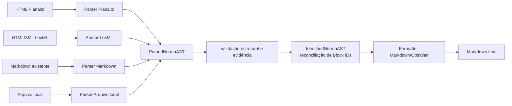

# ADR-002: NormaAST como camada intermediária desacoplada da fonte

## Status

Aceito — revisado em 2026-07-30

## Contexto

O Lex Editor precisa importar legislação de múltiplas fontes com formatos
e estruturas de marcação distintas:

- HTML do Planalto (leiaute próprio, historicamente instável entre leis e
  ao longo do tempo);
- HTML/XML do LexML (estrutura diferente da do Planalto, com sua própria
  convenção de marcação de hierarquia normativa);
- Markdown já formatado (reimportação de conteúdo já processado, ou
  conteúdo recebido de terceiros);
- arquivos locais fornecidos manualmente pelo editor jurídico (cópias de
  diários oficiais, PDFs convertidos, etc.).

Se o parser de cada fonte gerasse Markdown diretamente, toda a lógica de
reconhecimento de hierarquia (livro/título/capítulo/seção/subseção/
artigo/parágrafo/inciso/alínea/item), geração de Block IDs semânticos
(ADR-001), sinalização de dispositivos revogados/vetados, e validação
estrutural precisaria ser reimplementada — ou cuidadosamente duplicada —
em cada parser específico de fonte. Isso multiplica o risco de
inconsistência: um Block ID gerado de forma ligeiramente diferente pelo
parser do Planalto e pelo parser do LexML para a mesma posição jurídica
quebraria a promessa de estabilidade de IDs entre fontes diferentes da
mesma lei, e cada nova fonte adicionada exigiria reescrever regras de
geração de Markdown e de validação já existentes.

## Decisão

Introduzir uma **árvore normativa intermediária (NormaAST)**, desacoplada
da fonte de origem, como contrato único entre os parsers de fonte e o
restante do pipeline. O contrato possui duas fases validadas:
`ParsedNormaAST` (sem Block IDs) e `IdentifiedNormaAST` (após
atribuição/reconciliação, com IDs em todos os nós referenciáveis).

O fluxo é: **cada parser de fonte converte seus artefatos de entrada em
`ParsedNormaAST`** (reconhecimento de hierarquia, texto, flags de
revogação/veto, `sourceRef` e `parseEvidence`). Um adaptador pode consultar
mais de uma projeção da mesma fonte — por exemplo, HTML bruto e Markdown
limpo do Planalto — sem vazar esse formato para o domínio. O reconciliador
produz `IdentifiedNormaAST`. O **Formatter conhece apenas essa fase
identificada**, nunca a fonte original: ele produz o Markdown/Obsidian final (lista indentada,
frontmatter rico, callouts, Block IDs). Geração de Block IDs, validação
estrutural e regras de negócio (fidelidade ao texto oficial, sinalização
de dispositivos revogados/vetados, hierarquia jurídica) operam sobre a
NormaAST, de forma centralizada, independentemente de qual parser a
produziu.

## Consequências

**Positivas**

- Novas fontes podem ser adicionadas implementando apenas um novo parser
  que produz NormaAST — o Formatter, a geração de Block IDs e a validação
  estrutural não precisam ser tocados nem entendidos por quem escreve o
  novo parser.
- Validação estrutural (hierarquia bem formada, Block IDs consistentes,
  dispositivos revogados/vetados corretamente sinalizados) é centralizada
  em um único ponto, aplicada igualmente a qualquer fonte.
- O worker de atualização legislativa (`UPDATE_PIPELINE.md`) pode comparar
  NormaAST publicada com NormaAST candidata de forma uniforme, mesmo que
  a fonte de origem tenha mudado de leiaute — o diff estrutural opera
  sobre a árvore, não sobre HTML bruto.
- Facilita testes automatizados: é possível testar o Formatter e a
  validação estrutural com fixtures de NormaAST sintéticas, sem depender
  de HTML real de nenhuma fonte específica.
- Isola o impacto de mudanças de leiaute de fonte: quando o Planalto muda
  a estrutura do HTML, o ajuste fica contido no parser do Planalto, sem
  propagar risco de regressão para o Formatter ou para leis já
  processadas de outras fontes.

**Negativas / trade-offs aceitos**

- Introduz uma camada extra de abstração e um contrato de dados
  (schema da NormaAST) que precisa ser mantido, versionado e documentado
  à parte — custo de manutenção adicional em relação a um pipeline
  parser→Markdown direto.
- Exige disciplina de design: qualquer informação que o Formatter precise
  (por exemplo, uma nuance de formatação específica de uma fonte) precisa
  ser modelada como campo genérico da NormaAST, não como um caso especial
  vazando da fonte original.
- Pequeno overhead de processamento por manter uma representação
  intermediária completa em memória antes de gerar o Markdown final —
  aceitável dado o volume e a frequência de processamento do domínio
  (importação de leis, não um pipeline de alto volume em tempo real).

## Alternativas consideradas

### Parser → Markdown direto por fonte

Cada parser de fonte (Planalto, LexML, Markdown, arquivo local) gera o
Markdown final diretamente, sem uma representação intermediária comum.

Rejeitado porque:

- duplicaria a lógica de geração de Block IDs, validação estrutural e
  sinalização de dispositivos revogados/vetados em cada parser,
  aumentando o risco de dois parsers gerarem Block IDs
  inconsistentes para a mesma posição jurídica de leis equivalentes;
- tornaria a adição de uma nova fonte um trabalho de reimplementar todo o
  pipeline de geração de saída, em vez de apenas mapear a nova fonte para
  um contrato já existente;
- dificultaria o diff estrutural do worker de atualização, que precisaria
  comparar Markdown formatado (sensível a detalhes de apresentação) em
  vez de comparar estrutura normativa pura;
- tornaria testes automatizados mais frágeis, pois qualquer teste de
  validação estrutural precisaria ser reescrito por fonte, em vez de
  compartilhado sobre um schema comum.
