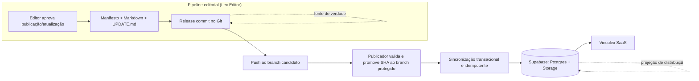

# ADR-003: Git como fonte canônica do conteúdo, Supabase como backend de distribuição

## Status

Aceito — revisado em 2026-07-30

## Contexto

O conteúdo do Vinculex (Markdown das leis, com Block IDs, frontmatter e
histórico de versões) precisa de:

- histórico completo e auditável de cada alteração, incluindo quem
  aprovou, quando e por quê (relevante inclusive para defender a
  fidelidade jurídica do acervo em caso de questionamento);
- diffs claros a nível de dispositivo entre versões, tanto para revisão
  humana no momento da aprovação (`UPDATE_PIPELINE.md`) quanto para
  auditoria posterior;
- rollback simples para uma versão anterior, caso uma publicação aprovada
  se revele incorreta após o fato;
- possibilidade de revisão por pull request, abrindo caminho para fluxo de
  dupla aprovação editorial no futuro (fora do escopo do MVP, ver
  ADR-004);
- backup automático e replicável, independente da disponibilidade do
  backend do SaaS;
- desacoplamento entre o pipeline editorial (Lex Editor, uso interno da
  equipe) e o Vinculex SaaS (consumo público/pago), de forma que uma
  instabilidade ou mudança de schema no Supabase não comprometa a
  integridade do conteúdo fonte.

O Supabase (Postgres + Storage + Auth + RLS) é o backend natural para
servir o SaaS — mas usar o Supabase Storage como fonte primária do
Markdown misturaria a responsabilidade de "armazenamento canônico
versionado" com a de "backend de distribuição para consumo público",
duas responsabilidades com requisitos de histórico, controle de acesso e
ciclo de vida bastante diferentes.

## Decisão

Um **repositório Git privado é a fonte canônica e única fonte de verdade**
do conteúdo Markdown das leis. O Supabase **não é fonte primária** — ele é
o **backend de distribuição** para o Vinculex SaaS, alimentado por uma
etapa explícita de sincronização a partir do Git.

Fluxo:

- Todo release commit no Git segue mensagem padronizada e só ocorre após
  aprovação humana explícita no Lex Editor (importação inicial ou
  atualização legislativa).
- O Git preserva o histórico completo de cada lei: cada versão publicada
  corresponde a exatamente um release commit identificável. O Markdown,
  o manifesto imutável e a nova entrada do `UPDATE.md` pertencem ao mesmo
  commit; `CHANGELOG.md` não é usado.
- Um release commit publica exatamente uma lei. Exportação em lote continua
  permitida, mas não é publicação; agrupar várias leis no mesmo commit
  impediria retry, rollback e auditoria independentes.
- Um commit apenas local não é canônico nem “publicado”. O release commit
  torna-se canônico quando o Serviço de Publicação promove o SHA validado do
  branch candidato ao branch remoto protegido; o Supabase pode permanecer
  temporariamente com sincronização pendente.
- A sincronização com o Supabase é um passo subsequente e idempotente:
  executada apenas pelo Serviço de Publicação, recebe uma chave de
  idempotência, lê pelo SHA o release commit exato,
  valida hashes e grava um snapshot completo em uma única transação. O
  ponteiro da versão pública é trocado somente no final; retry não cria novo
  commit nem nova versão.
- A versão usa SemVer sem prefixo `v` no dado (`1.4.0`) e um
  `numero_publicacao` monotônico para ordenação. A convenção detalhada vive em
  `DATA_MODEL.md`, seção “Contrato de versão e publicação”.
- A estação do Lex Editor não possui secret administrativa do Supabase nem
  permissão de escrita no branch protegido; a fronteira de confiança completa
  está em `ADR-007-fronteira-segura-publicacao.md`.
- Rollback nunca é um sync direto de commit antigo. É uma nova publicação para
  frente, que restaura o snapshot escolhido em novo release commit, nova
  versão, nova entrada no `UPDATE.md` e nova transação de sync. Git e banco
  nunca têm o histórico reescrito.

## Consequências

**Positivas**

- Histórico, diff e rollback ficam gratuitos, usando uma ferramenta madura
  e amplamente testada (Git), em vez de reimplementar essas capacidades
  no banco de dados.
- Revisão por pull request se torna uma extensão natural do fluxo
  existente, sem necessidade de construir um sistema de revisão próprio,
  caso o projeto evolua para exigir dupla aprovação editorial.
- O pipeline editorial (Lex Editor) funciona de forma desacoplada do
  Supabase: é possível importar, revisar e commitar leis mesmo que o
  Supabase esteja temporariamente indisponível; a sincronização acontece
  quando o backend voltar.
- Backup e replicação do conteúdo canônico seguem o modelo padrão de
  repositórios Git (clones, mirrors, providers como GitHub/GitLab),
  reduzindo dependência de um único provedor de infraestrutura para a
  integridade do acervo.
- Auditoria fica mais forte: qualquer alteração de conteúdo normativo é
  rastreável a um commit específico, autor e timestamp, sem depender de
  uma tabela de auditoria construída manualmente no banco.

**Negativas / trade-offs aceitos**

- O Supabase deixa de ser fonte de verdade e passa a ser **cache/índice de
  distribuição**: existe risco de defasagem temporária entre o Git e o
  Supabase caso a sincronização falhe ou atrase, exigindo monitoramento
  do passo de sincronização e reprocessamento idempotente em caso de
  falha (ver `UPDATE_PIPELINE.md`, seção 9).
- É necessário manter e operar um passo de sincronização Git → Supabase
  como componente próprio do pipeline, com sua própria lógica de
  idempotência, tratamento de falhas e reconciliação de estado.
- Requer disciplina operacional: qualquer alteração de conteúdo precisa
  necessariamente passar pelo Git — não pode haver atalho de edição
  direta no Supabase, sob risco de o Git deixar de refletir a realidade
  publicada.

## Alternativas consideradas

### Supabase Storage como única fonte

Armazenar o Markdown diretamente no Supabase Storage, sem repositório Git,
usando o próprio Postgres para registrar metadados de versão.

Rejeitado porque:

- Supabase Storage não oferece diff estrutural nem histórico de qualidade
  nativa comparável ao Git — qualquer capacidade de diff/histórico
  precisaria ser construída manualmente sobre o Storage/Postgres;
- rollback exigiria lógica própria de versionamento de objetos, em vez de
  reutilizar um mecanismo já maduro e testado;
- revisão por pull request não existe nativamente no Supabase Storage,
  exigindo construção de um fluxo de revisão do zero caso o projeto
  precise dele no futuro;
- acopla o pipeline editorial à disponibilidade do Supabase para toda e
  qualquer operação de conteúdo, inclusive as que não deveriam depender
  do backend do SaaS (importação, revisão, edição local no Lex Editor).

### Sistema de versionamento próprio no banco de dados

Construir uma tabela de versões, snapshots e diffs de dispositivos
diretamente no Postgres, sem depender de Git.

Rejeitado porque:

- reinventa funcionalidades que o Git já resolve de forma madura e
  testada (histórico, diff, branch, merge, rollback), aumentando
  significativamente o esforço de desenvolvimento e manutenção;
- perde as vantagens de portabilidade e ferramentas do ecossistema Git
  (clientes de diff, ferramentas de revisão, integração com CI, backups
  padronizados via provedores Git);
- dificulta a colaboração e a revisão por pares no formato de pull
  request, que é o padrão familiar para revisão de mudanças em
  engenharia de software e poderia ser reaproveitado diretamente para
  revisão editorial.
