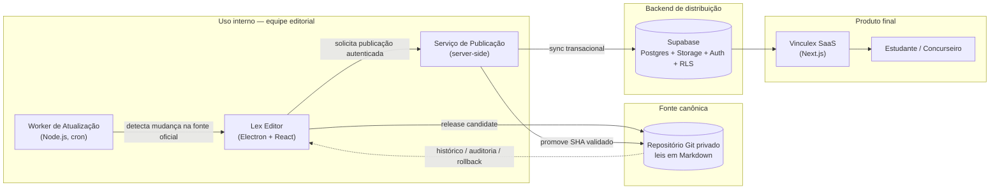
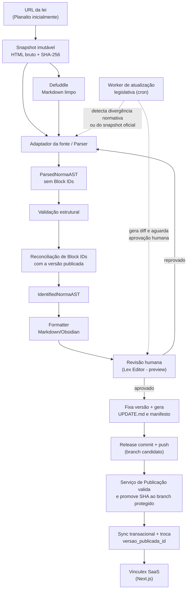

# Arquitetura do Sistema — Vinculex

> Documento de arquitetura compartilhada entre **Lex Editor** e **Vinculex SaaS**.
> Esta é a fonte única de verdade para decisões técnicas que atravessam os dois produtos.
> Especificações de detalhe vivem em documentos irmãos e são apenas referenciadas aqui:
> `./BLOCK_ID_SPEC.md`, `./MARKDOWN_SPEC.md`, `./UPDATE_PIPELINE.md`.

## Sumário

- [Visão geral do ecossistema](#visão-geral-do-ecossistema)
- [Princípios arquiteturais](#princípios-arquiteturais)
- [Pipeline completo](#pipeline-completo)
- [Componentes do pipeline](#componentes-do-pipeline)
- [Contratos entre sistemas](#contratos-entre-sistemas)
- [Estratégia de deploy e hospedagem](#estratégia-de-deploy-e-hospedagem)
- [Segurança e permissões](#segurança-e-permissões)
- [Evolução futura](#evolução-futura)

---

## Visão geral do ecossistema

O Vinculex é composto por quatro peças que operam em ritmos diferentes, mas
compartilham contratos normativos versionados.



- **Lex Editor** é a ferramenta de trabalho da equipe editorial: importa a lei de uma fonte oficial, transforma em NormaAST, atribui Block IDs, gera o Markdown, permite revisão humana e, só então, publica.
- **Worker de atualização legislativa** roda de forma independente (cron), monitora as fontes oficiais, calcula hash de conteúdo e sinaliza divergências — mas nunca publica sozinho, apenas cria uma proposta de atualização que a equipe aprova no Lex Editor.
- **Serviço de Publicação** é a única workload com autoridade de produção:
  valida identidade, aprovação, branch candidato, manifesto e hashes; promove o
  SHA exato ao branch protegido e executa o sync transacional.
- **Vinculex SaaS** é o produto voltado ao usuário final (estudante/concurseiro): lê exclusivamente dados já validados e publicados no Supabase. Não tem acesso de escrita ao conteúdo normativo, nem conhece o pipeline de parsing.

O Git guarda a história completa e é a fonte de verdade; o Supabase é uma **cópia de distribuição otimizada para leitura** consumida pelo SaaS.

---

## Princípios arquiteturais

1. **Fidelidade jurídica antes de tudo.** O sistema existe para representar a lei com exatidão. Qualquer decisão de UX, performance ou conveniência técnica cede diante do risco de alterar o sentido, a hierarquia ou o texto de um dispositivo legal. Divergências entre o Markdown e a fonte oficial são tratadas como bug crítico.

2. **Git como fonte canônica, não o banco de dados.** Leis mudam raramente e precisam de auditoria: quem alterou o quê, quando, e por quê. Um repositório Git privado dá diff textual, histórico completo, revisão via Pull Request e possibilidade de rollback trivial — algo que um banco relacional só replica com esforço extra. O Supabase nunca é editado diretamente; ele reflete o que está no Git.

3. **Aprovação humana obrigatória em toda publicação.** Nenhum conteúdo chega
   ao usuário final sem revisão e aprovação editorial explícitas, seja na
   importação inicial, seja em atualização legislativa. A decisão humana
   autoriza apenas a proposta; promoção do SHA e sync formam um segundo gate,
   técnico e server-side, executado pelo Serviço de Publicação após revalidar
   a aprovação.

4. **Obsidian-first.** O formato Markdown é desenhado para ser 100% funcional dentro do Obsidian (links internos, listas indentadas, callouts, frontmatter YAML) antes de ser adaptado para qualquer outro consumidor. Isso garante que o repositório de leis seja útil por si só, independente do SaaS existir ou não.

5. **Separação rígida entre Lex Editor e Vinculex SaaS.** São bases de código, times de responsabilidade e ciclos de release distintos. O Lex Editor nunca embute lógica de usuário final (favoritos, autenticação de estudante, etc.) e o SaaS nunca embute lógica de parsing ou geração de Markdown. A única interface entre os dois é o contrato de dados publicado (ver [Contratos entre sistemas](#contratos-entre-sistemas)).

6. **Testabilidade com leis reais.** Parser, NormaAST e Formatter são validados contra um conjunto de leis reais e complexas (Código Penal, CPP, CF/88, ECA, CTB, Lei 14.133), não apenas fixtures sintéticas. Regressões de parser são o maior risco técnico do projeto e exigem cobertura de teste com casos reais, incluindo dispositivos revogados, vetados e redações dadas por leis posteriores.

---

## Pipeline completo



---

## Componentes do pipeline

**URL da lei.** Ponto de entrada: um link para a publicação oficial (Planalto, LexML ou outra fonte confiável). É o único artefato que o editor precisa fornecer para iniciar a importação de uma lei nova.

**Defuddle (extração HTML → Markdown limpo).** Remove ruído de navegação,
scripts, propaganda e formatação inconsistente, produzindo uma projeção textual
útil. É uma etapa de limpeza, não de interpretação jurídica. O HTML bruto é
preservado como snapshot imutável com SHA-256; o Markdown limpo nunca o
substitui como evidência de origem.

**Parser.** Cada adaptador interpreta os artefatos adequados à fonte — o
Planalto pode usar HTML bruto e Markdown limpo em conjunto — e produz
`ParsedNormaAST` com rastreabilidade e evidência por nó. Reconhece livros,
títulos, capítulos, seções, subseções, artigos, parágrafos, incisos, alíneas,
itens, penas autônomas, anexos, tabelas e estados jurídicos de dispositivos.

**NormaAST.** Árvore normativa intermediária independente da origem.
`ParsedNormaAST` é a saída validada do Parser; `IdentifiedNormaAST` é a saída
do reconciliador de Block IDs e a única aceita por Formatter, persistência e
publicação. Componentes de domínio operam sobre a árvore; apenas adaptadores de
fonte consultam HTML/XML/Markdown de entrada.

**Atribuição e reconciliação de Block IDs.** Na primeira publicação, percorre
a NormaAST e gera deterministicamente um identificador semântico para cada
dispositivo (ex.: `cp-art-121-par-2-inc-viii`). Depois da publicação, carrega a
última NormaAST canônica e o registro histórico, reutiliza IDs existentes e
gera valores apenas para dispositivos novos. O valor persistido não contém
`^`; o Formatter acrescenta o prefixo ao produzir a âncora Obsidian
`^cp-art-121-par-2-inc-viii`. IDs e aliases publicados formam um namespace
append-only. Regras completas em `./BLOCK_ID_SPEC.md`.

**Formatter Markdown/Obsidian.** Serializa a NormaAST com Block IDs em Markdown final: lista indentada hierárquica, frontmatter rico, callouts de cabeçalho. É a última etapa automática antes da revisão humana. Especificação completa em `./MARKDOWN_SPEC.md`.

**Revisão humana (Lex Editor).** Um editor jurídico visualiza o preview renderizado, compara com a fonte oficial e aprova ou rejeita. Se rejeitado, o fluxo retorna ao Parser (ajuste de regras) ou à correção manual pontual. Nenhum conteúdo avança sem esse gate.

**Release commit no Git.** Após aprovação, o Lex Editor prepara um manifesto
imutável e grava, no mesmo commit, o Markdown e a entrada correspondente do
`UPDATE.md`. A estação envia esse commit apenas ao branch candidato
`releases/{publicationId}`. Ele se torna canônico somente quando o Serviço de
Publicação valida e promove o mesmo SHA ao branch protegido.

**Sync/Publicação no Supabase.** Exclusivamente o Serviço de Publicação lê o
release commit pelo SHA, valida manifesto/aprovação e grava o snapshot completo
em uma transação idempotente. Somente no final troca
`leis.versao_publicada_id`. O Electron nunca recebe a secret administrativa.

**Vinculex SaaS.** Consome exclusivamente dados já publicados no Supabase via Postgres/Auth/RLS. Não tem qualquer dependência de tempo de execução do Lex Editor, do Parser ou do Git.

**Worker de atualização legislativa.** Processo cron independente que periodicamente busca a fonte oficial, calcula hash do conteúdo, compara com o hash da última versão publicada e, ao detectar divergência, gera um diff e cria uma proposta de atualização para revisão no Lex Editor. Nunca publica automaticamente — apenas alimenta a fila de revisão humana. Fluxo detalhado em `./UPDATE_PIPELINE.md`.

---

## Contratos entre sistemas

### O que o Lex Editor entrega ao Git

Um arquivo Markdown por lei, seu `UPDATE.md` e um manifesto JSON imutável por
release, seguindo `./MARKDOWN_SPEC.md` e o contrato de publicação de
`./DATA_MODEL.md`. O release commit é a unidade de auditoria: os três artefatos
correspondentes são inseparáveis.

### Estrutura de pastas do repositório Git de leis

```
leis/
  codigo-penal/
    cp.md
    UPDATE.md
    .vinculex/
      releases/
        000001-1.0.0.json
  codigo-processo-penal/
    cpp.md
    UPDATE.md
  constituicao-federal/
    cf88.md
    UPDATE.md
  estatuto-crianca-adolescente/
    eca.md
    UPDATE.md
  codigo-transito-brasileiro/
    ctb.md
    UPDATE.md
  lei-14133-licitacoes/
    lei-14133.md
    UPDATE.md
```

Convenções:

- Um diretório por lei, nomeado em `kebab-case` a partir do nome popular ou sigla consagrada (`codigo-penal`, não `decreto-lei-2848-1940`).
- O arquivo principal usa a sigla curta da lei (`cp.md`, `cpp.md`, `cf88.md`, `eca.md`, `ctb.md`) para favorecer links wiki curtos no Obsidian (`[[cp#^cp-art-121]]`).
- `UPDATE.md` é o único changelog por lei e registra toda publicação,
  inclusive a inicial, em linguagem legível por humanos. Ele integra sempre o
  mesmo release commit do arquivo principal; `CHANGELOG.md` não existe no
  contrato.
- `.vinculex/releases/{numero_publicacao com 6 dígitos}-{versao_vinculex}.json`
  é append-only e guarda o manifesto do release, incluindo chave de
  idempotência, commit-base esperado e hashes dos artefatos. Um retry reutiliza
  o mesmo caminho e bytes.
- Leis muito extensas podem futuramente ser divididas por Livro/Título em arquivos separados dentro do mesmo diretório, desde que a convenção seja formalizada em `./MARKDOWN_SPEC.md` antes de ser adotada — não é o padrão atual.

### O que o SaaS espera receber (contrato de leitura via Supabase)

- `api.leis_publicadas` com metadados públicos da lei, sem necessidade de
  reparsear Markdown ou consultar tabelas editoriais.
- Dispositivos individualizados por Block ID, com texto, hierarquia (caminho até a raiz: artigo → parágrafo → inciso) e `device_status` (`active`, `revoked`, `vetoed`, `included`, `amended`, `renumbered`, `suspended`, `unknown`), para permitir navegação, busca de texto integral e ancoragem de notas/favoritos por Block ID.
- Block IDs são entregues sem `^`. `api.resolver_block_id` resolve aliases,
  detecta ciclos e retorna o destino canônico antes de um 404.
- `api.changelog_publico` expõe `versao_vinculex`, `numero_publicacao`,
  datas, resumo e `mudancas` estruturadas. `git_commit_sha`,
  `conteudo_sha256`, fontes, evidências e identidade do aprovador permanecem
  internos.

O detalhamento de tabelas e colunas fica em `./DATA_MODEL.md`; este documento define apenas a fronteira de responsabilidade.

---

## Estratégia de deploy e hospedagem

| Componente | Forma de distribuição/hospedagem | Observações |
|---|---|---|
| Lex Editor (Electron) | Build distribuído internamente à equipe editorial (instalador ou pacote assinado) | Não é publicado em loja pública; uso restrito ao time interno |
| Worker de atualização legislativa | Processo Node.js hospedado em Railway ou Fly.io, com cron interno ou disparado por scheduler da plataforma | Sem estado persistente relevante além de hashes de comparação, que podem viver no próprio Supabase |
| Serviço de Publicação | Workload server-side isolada (Railway/Fly.io, CI protegido ou equivalente) | Única identidade capaz de promover o branch canônico e executar a função privada de publicação |
| Repositório Git de leis | Provedor Git privado (ex.: GitHub/GitLab privado) | Controle de acesso via permissões de repositório; histórico é o ativo principal |
| Supabase | Instância gerenciada (Postgres + Storage + Auth) | Projetos separados para desenvolvimento/staging e produção; nenhuma credencial é compartilhada |
| Vinculex SaaS (Next.js) | Vercel (ou equivalente) | Deploy standard de aplicação Next.js consumindo Supabase via SDK/Edge Functions |
| Asaas | Serviço externo gerenciado | Checkout e cobranças Premium em BRL; webhook entra por endpoint server-side autenticado e reconciliado conforme ADR-008 |

Cada componente tem ciclo de deploy independente: uma nova versão do Lex Editor não exige deploy do SaaS, e vice-versa. O único acoplamento real em tempo de execução é o schema do Supabase, versionado via migrations.

---

## Segurança e permissões

- **Quem decide e quem executa.** Editor Jurídico autenticado aprova o digest;
  apenas o Serviço de Publicação executa. Administrador Técnico não pode
  aprovar mudança normativa sozinho, e nenhum cliente chama sync diretamente.
- **Electron sem autoridade de produção.** Renderer é não confiável; preload
  expõe capacidades mínimas; processo principal não possui secret
  administrativa do Supabase. Preferências seguras, IPC, filesystem, Git,
  importação e logs seguem `./ADR-007-fronteira-segura-publicacao.md`.
- **Grants + RLS.** O SaaS lê apenas views/RPCs públicas sobre
  `versao_publicada_id`. Tabelas editoriais/base não têm grants para
  `anon`/`authenticated`; escrita normativa pertence à função privada chamada
  pela role dedicada do publicador. Uma secret administrativa, se usada no
  MVP, vive somente na workload server-side e é tratada como bypass total de
  RLS.
- **Worker de menor privilégio.** A identidade do worker cria pendências por
  API/função limitada; não escreve conteúdo normativo, Git canônico ou
  `publicacoes`.
- **Cobrança sem autoridade no cliente.** Checkout Asaas é criado no servidor;
  retorno do navegador não concede Premium. Eventos são autenticados,
  deduplicados e reconciliados com a API antes de alterar entitlements, conforme
  `./ADR-008-monetizacao-e-gateway.md`.
- **Segregação real de ambientes.** Desenvolvimento/staging e produção usam
  projetos, repositórios, roles e secrets distintos. `.env` é permitido apenas
  para valores locais não produtivos; secrets de produção ficam no secret
  manager da workload.

---

## Evolução futura

O pipeline foi desenhado para que o Git seja a única fonte a partir da qual múltiplos destinos de publicação possam ser alimentados, sem reprocessar a lei:

- **GitHub público (read-only).** Espelhamento do repositório de leis (ou de uma seleção de leis) para um repositório público, permitindo que a comunidade jurídica consulte e cite o Markdown diretamente, com todo o histórico de auditoria preservado.
- **Obsidian Publish.** Publicação direta do vault de leis (ou subconjunto) via Obsidian Publish, aproveitando que o Markdown já é nativamente compatível, sem etapa de conversão adicional.
- **Exportação local para vaults de usuários avançados.** Distribuição de pacotes `.zip` do conteúdo Markdown para uso offline em Obsidian pessoal, fora do SaaS — cenário relevante para usuários que preferem não depender de conectividade.
- **Novos formatos de consumo.** A separação entre NormaAST e Formatter permite, no futuro, gerar outros formatos de saída (ex.: JSON estruturado para APIs de terceiros, EPUB, PDF) sem alterar Parser ou Block IDs, já que ambos operam sobre a NormaAST e não sobre o Markdown final.

Qualquer novo destino de publicação deve consumir o Git (ou, no caso de dados estruturados, o Supabase) como fonte — nunca reimplementar parsing próprio, para preservar o princípio de fidelidade jurídica e Block IDs estáveis.
