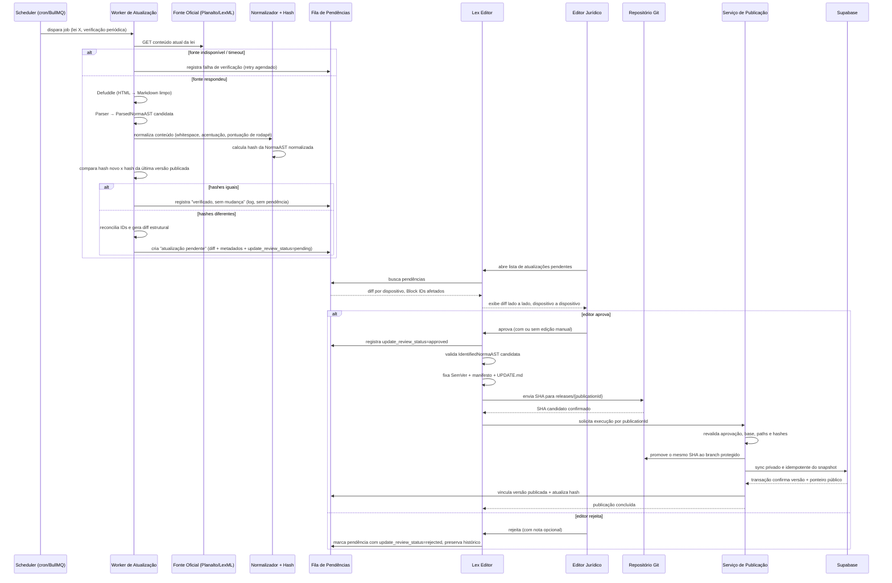

# Pipeline de Atualização Legislativa

> Componentes: Worker de Atualização Legislativa + Lex Editor + Serviço de Publicação
> Status: Especificação de arquitetura (MVP)
> Última atualização: 2026-07-30

## Sumário

- [1. Visão geral](#1-visão-geral)
- [2. Diagrama de sequência](#2-diagrama-de-sequência)
- [3. Estratégia de detecção](#3-estratégia-de-detecção)
- [4. Estrutura do diff](#4-estrutura-do-diff)
- [5. Regras de preservação de Block IDs](#5-regras-de-preservação-de-block-ids)
- [6. Interface conceitual de revisão no Lex Editor](#6-interface-conceitual-de-revisão-no-lex-editor)
- [7. Geração do UPDATE.md e numeração de versão](#7-geração-do-updatemd-e-numeração-de-versão)
- [8. Rejeição](#8-rejeição)
- [9. Falhas e reprocessamento](#9-falhas-e-reprocessamento)

## 1. Visão geral

Leis mudam. Uma lei publicada no Vinculex hoje pode ser alterada por uma lei
posterior, revogada parcialmente, ter dispositivos vetados derrubados por
promulgação do Congresso, ou simplesmente ter erratas de publicação
corrigidas pelo órgão oficial. O Vinculex precisa detectar essas mudanças na
fonte oficial (Planalto, LexML) e refletir o novo texto no acervo — mas
nunca de forma automática e silenciosa.

Um worker de atualização legislativa roda de forma independente do Lex
Editor e do SaaS. Ele periodicamente busca a fonte oficial de cada lei
cadastrada, reaproveita a mesma cadeia snapshot → Defuddle → Parser →
`ParsedNormaAST` usada na
importação inicial, calcula um hash do conteúdo normalizado e compara com o
hash da última versão publicada. Quando encontra divergência, o worker gera
um diff estrutural (a nível de dispositivo, não de linha de texto bruto) e
registra uma **atualização pendente**. Esse é o limite da autonomia do
worker: ele nunca publica, nunca sobrescreve o Markdown canônico e nunca
gera commit no Git.

### Por que aprovação humana é obrigatória

Publicar automaticamente uma leitura de mudança legislativa é um risco que
o Vinculex não pode assumir, por três razões concretas:

1. **Risco jurídico direto.** Um parser pode interpretar errado uma
   renumeração de inciso, confundir um dispositivo revogado com um
   simplesmente reordenado, ou falhar ao capturar uma ressalva/exceção
   introduzida no meio de um parágrafo. Se isso for publicado sem revisão,
   um estudante ou profissional pode estudar por um texto normativo
   incorreto — e o produto existe justamente para evitar isso.
2. **Fragilidade estrutural das fontes.** HTML do Planalto e do LexML muda
   de leiaute com frequência, sem aviso. Uma mudança de leiaute pode ser
   confundida pelo parser com uma mudança de conteúdo, gerando diffs
   espúrios ou, pior, diffs que silenciosamente omitem uma mudança real.
3. **Credibilidade do produto.** O valor central do Vinculex é ser a fonte
   confiável e citável de legislação estruturada. Um único erro de
   publicação automática compromete a confiança de todo o acervo, não
   apenas do dispositivo afetado.

Por isso, a regra de negócio "parser/worker nunca publica automaticamente
sem validação humana" é tratada como inegociável em qualquer camada do
pipeline de atualização, sem exceção mesmo para mudanças aparentemente
triviais (ver ADR-004).

## 2. Diagrama de sequência

## 3. Estratégia de detecção

### 3.1 Frequência de verificação

- Verificação padrão: diária, em janela de baixo tráfego (madrugada,
  horário de Brasília), via cron ou job agendado no BullMQ.
- Leis com histórico de alteração frequente (ex.: leis orçamentárias,
  normas tributárias) podem ter frequência configurável mais alta
  (ex.: a cada 6 horas), definida por metadado da lei cadastrada.
- Verificação sob demanda: o editor jurídico pode forçar uma verificação
  manual de uma lei específica a partir do Lex Editor, útil quando há
  notícia de alteração recente e não se quer esperar o ciclo automático.

### 3.2 Normalização antes do hash

O hash não pode ser calculado sobre o HTML bruto nem sobre o Markdown
bruto, porque isso geraria falsos positivos constantes por diferenças
irrelevantes de formatação (espaços extras, quebras de linha, ordem de
atributos HTML, mudanças de leiaute do site que não alteram o texto
normativo). O worker calcula o hash sobre uma **projeção normativa da
`ParsedNormaAST`**, após:

- colapsar espaços múltiplos e normalizar quebras de linha;
- normalizar unicode (NFC) e remover caracteres invisíveis/zero-width;
- remover metadados voláteis da fonte (timestamps de geração de página,
  contadores de visualização, IDs de sessão presentes no HTML);
- normalizar pontuação de rodapé e notas de vigência para uma forma
  canônica antes de comparar;
- serializar a NormaAST em uma forma determinística (ordem estável de
  campos, sem formatação de exibição) antes de aplicar o hash
  (SHA-256).

`id`, `blockId`, `astPhase`, `sourceRef`, `parseEvidence` e metadados
operacionais ficam fora do hash normativo: mudanças de seletor, confiança ou
localização na página não representam, por si só, alteração legislativa. O
snapshot bruto mantém seu próprio SHA-256, e mudanças apenas de evidência podem
gerar alerta técnico separado sem criar diff jurídico.

O hash de referência é sempre o da **projeção normativa da última
`IdentifiedNormaAST` publicada e aprovada**
(não da última verificação do worker), para que uma sequência de
verificações sem aprovação não acumule diffs incrementais incorretos.

### 3.3 Fontes monitoradas

- Planalto (planalto.gov.br) — fonte primária para legislação federal.
- LexML — fonte complementar, usada como referência cruzada e para leis
  não disponíveis em formato estável no Planalto.
- Cada lei cadastrada armazena a URL canônica de origem e, quando
  aplicável, uma URL secundária de checagem cruzada. Divergência entre
  fontes primária e secundária é sinalizada separadamente e não gera
  atualização pendente automática — apenas um alerta para investigação
  manual.

## 4. Estrutura do diff

O diff não é um diff de texto linha a linha. Ele é calculado por
comparação estrutural entre a NormaAST publicada e a NormaAST candidata.
Antes do diff, o worker carrega a última NormaAST publicada, o registro
append-only de Block IDs e os aliases da lei. O lado candidato ainda não é
autoritativo: ele é reconciliado com a identidade jurídica publicada e só
depois recebe IDs novos onde não houver correspondência.

Categorias de resultado por dispositivo, mapeadas para o valor resultante
do campo `deviceStatus` (ver `./ADR-005-status-fields.md`) que a NormaAST
candidata assume caso a atualização seja aprovada:

| Categoria | `deviceStatus` resultante | Significado | Tratamento de Block ID |
|---|---|---|---|
| Inalterado | `active` (mantido) | Texto normalizado idêntico | Mantém o mesmo Block ID |
| Alterado | `amended` | Mesma posição hierárquica, texto normalizado diferente | Mantém o mesmo Block ID, novo texto associado |
| Novo | `included` | Dispositivo sem correspondência na versão publicada | Recebe Block ID novo; se o candidato simples já estiver reservado, somente o novo dispositivo recebe qualificação estrutural |
| Revogado | `revoked` | Dispositivo presente na versão publicada, ausente/expressamente revogado na candidata | Mantém o Block ID, marcado com `deviceStatus: 'revoked'`, texto original preservado |
| Renumerado | `renumbered` | Ato normativo renumera explicitamente um dispositivo existente | O ID antigo continua reservado; a nova posição recebe ID canônico próprio e um redirecionamento permanente liga o ID antigo ao novo |

Cada entrada de diff carrega:

- Block ID afetado (ou `null` para dispositivo novo antes da geração de ID);
- categoria (inalterado, alterado, novo, revogado, renumerado), correspondente ao `deviceStatus` resultante da tabela acima;
- texto anterior (quando existir) e texto candidato, lado a lado;
- caminho hierárquico (livro/título/capítulo/seção/subseção/artigo/
  parágrafo/inciso/alínea/item) em ambas as versões;
- indicador de confiança do parser (para sinalizar ao editor casos em que
  o parser teve baixa certeza na correspondência entre dispositivo
  publicado e candidato — por exemplo, quando o casamento foi feito por
  similaridade de texto e não por Block ID direto).

A renumeração é o caso mais delicado: o worker tenta primeiro reconciliar
pela identidade publicada e pela posição jurídica. Se não houver
correspondência exata, mas houver evidência de renumeração explícita no ato
alterador e alta similaridade com um dispositivo deslocado, ele propõe a
criação do novo ID e do redirecionamento. Similaridade textual sozinha nunca
autoriza uma renumeração automática. A proposta é sempre sinalizada na
interface de revisão; o editor confirma ou corrige a correspondência.

## 5. Regras de preservação de Block IDs

As regras abaixo são absolutas e não podem ser contornadas por nenhuma
etapa automatizada do pipeline:

1. **Dispositivo inalterado** mantém o Block ID original. Nenhuma ação
   além de confirmar a correspondência.
2. **Dispositivo com texto alterado** mantém o Block ID original, mesmo
   que o conteúdo textual mude completamente. O Block ID identifica a
   posição jurídica do dispositivo (ex.: `cp-art-121-par-2-inc-viii`), não
   o conteúdo — por isso sobrevive a alterações de redação (ver
   ADR-001).
3. **Dispositivo genuinamente novo** (sem correspondência estrutural nem
   por posição nem por conteúdo deslocado) recebe um Block ID novo,
   gerado seguindo as regras de `BLOCK_ID_SPEC.md` e validado contra todo
   o namespace histórico. Se o candidato simples colidir com um ID já
   emitido, apenas o novo dispositivo recebe a menor qualificação
   estrutural livre; o ID antigo não muda.
4. **Dispositivo removido/revogado** nunca é deletado do Markdown nem do
   histórico. Ele é marcado com `deviceStatus: 'revoked'` (callout/
   marcação inline, conforme convenção do Formatter — ver
   `./ADR-005-status-fields.md`), preserva o Block ID original e
   preserva o texto histórico como havia sido publicado por último. Isso
   garante que qualquer âncora `^block-id` já existente em notas de
   estudantes ou em outros documentos do Obsidian continue resolvendo,
   agora apontando para um dispositivo claramente sinalizado como
   revogado.
5. **Renumeração explícita** gera um ID canônico para a nova posição, mas
   não apaga nem libera o ID anterior. O pipeline registra um
   redirecionamento permanente `id_antigo -> id_novo`, preserva ambos no
   namespace histórico e inclui a decisão no changelog do `UPDATE.md`.
6. **Reconstrução pós-publicação** sempre parte do Git e do registro
   versionado. Regerar IDs usando apenas a NormaAST candidata é proibido.

## 6. Interface conceitual de revisão no Lex Editor

O editor jurídico interage com o pipeline de atualização inteiramente
dentro do Lex Editor, nunca diretamente com o worker ou com o Git.

### 6.1 Lista de pendências

Uma tela dedicada lista todas as atualizações pendentes, com:

- nome da lei e link para a fonte oficial verificada;
- data/hora da última verificação e da geração do diff;
- contagem resumida por categoria (ex.: "3 alterados, 1 novo, 0
  revogados, 1 renumerado");
- indicador de confiança geral do parser para aquela pendência;
- ação rápida: abrir revisão, adiar, descartar (equivalente a rejeitar
  sem revisão detalhada, reservado a casos óbvios de falso positivo).

### 6.2 Diff lado a lado por dispositivo

Ao abrir uma pendência, o editor vê, dispositivo a dispositivo:

- painel esquerdo: texto publicado atual (com Block ID visível);
- painel direito: texto candidato extraído da fonte;
- realce de diferença textual dentro do dispositivo (nível de palavra/
  frase, não apenas "mudou/não mudou");
- selo de categoria (inalterado, alterado, novo, revogado, renumerado),
  refletindo o `deviceStatus` resultante (Seção 4);
- para renumeração: indicação visual da posição antiga e da posição nova,
  com a correspondência proposta pelo worker explicitada.

### 6.3 Ações disponíveis

- **Aprovar dispositivo a dispositivo** ou aprovar a pendência inteira de
  uma vez, quando o editor confia no conjunto completo do diff.
- **Editar manualmente antes de aprovar**: o editor pode ajustar o texto
  candidato diretamente na interface (por exemplo, corrigir uma captura
  imperfeita do parser) antes de confirmar a aprovação; a versão editada
  manualmente é o que efetivamente entra no commit.
- **Rejeitar** a pendência inteira ou dispositivos específicos, com campo
  de nota obrigatório explicando o motivo (usado tanto para auditoria
  quanto para orientar reprocessamento futuro).
- **Corrigir correspondência de renumeração**: quando o worker propõe uma
  correspondência de renumeração que o editor considera incorreta, o
  editor pode desfazer a proposta e reclassificar manualmente os
  dispositivos envolvidos como novo/revogado.

Nenhuma dessas ações grava no Git até que o editor confirme a aprovação
final da pendência como um todo.

## 7. Geração do UPDATE.md e numeração de versão

Ao aprovar uma pendência:

1. O Lex Editor aplica a NormaAST candidata (com eventuais edições manuais)
   sobre a `IdentifiedNormaAST` publicada e reconcilia Block IDs conforme a
   seção 5.
2. O serviço fixa uma única versão SemVer, sem prefixo `v` no dado. A primeira
   publicação é `1.0.0`; atualização que muda a projeção normativa incrementa
   `MINOR`; correção sem mudança normativa incrementa `PATCH`; mudança
   incompatível do contrato de representação incrementa `MAJOR`. Versões nunca
   são reutilizadas ou reduzidas.
3. O `UPDATE.md` — único changelog da lei — recebe uma entrada inclusive na
   publicação inicial, contendo:
   - data da publicação da atualização;
   - `versao_vinculex`, `numero_publicacao` e tipo de publicação;
   - resumo da origem e atribuição pública não pessoal; a identidade real do
     editor fica somente na auditoria privada;
   - lista de Block IDs novos, alterados, revogados e renumerados nesta
     versão, com breve descrição de cada mudança;
   - referência à norma alteradora e ao diff completo, quando aplicável;
   - em rollback, versão restaurada e justificativa obrigatória.
4. O Markdown da lei é atualizado com o novo texto, mantendo a
   formatação padrão do Formatter (lista indentada, frontmatter rico,
   callouts apenas no cabeçalho).
5. Antes de gravar o Git, o Lex Editor persiste um manifesto com chave de
   idempotência, commit-base esperado e hashes da AST, do Markdown, do
   `UPDATE.md` e da fonte. Markdown, `UPDATE.md` e manifesto entram no mesmo
   release commit, por exemplo:
   `update(lei-XXXX): vX.Y.Z — 3 dispositivos alterados, 1 novo`.
6. A estação envia o commit somente para
   `releases/{publicationId}`. O Serviço de Publicação revalida no servidor a
   aprovação, o commit-base, o SHA, os paths e todos os hashes do manifesto.
7. Se as verificações passarem, o serviço promove exatamente esse SHA ao
   branch canônico protegido e grava o snapshot completo no Supabase por uma
   função privada e transacional. Só então troca o ponteiro público, marca a
   publicação como concluída, vincula a versão à pendência já `approved` e
   atualiza o hash de referência do worker. A estação nunca recebe a
   credencial do branch protegido nem uma secret administrativa do banco.

O contrato completo, inclusive rollback e retentativas, está em
`DATA_MODEL.md`, seção “Contrato de versão e publicação”; a separação de
autoridade e os controles de segurança estão no
`ADR-007-fronteira-segura-publicacao.md`.

## 8. Rejeição

Quando o editor rejeita uma pendência (total ou parcialmente):

- A pendência permanece registrada com `update_review_status = 'rejected'`,
  nunca é apagada — isso preserva histórico de auditoria de decisões
  editoriais.
- O editor pode anexar uma nota em `rejection_reason` explicando o motivo
  (ex.: "parser não capturou corretamente a ressalva do § 4º, aguardando
  ajuste do parser antes de reavaliar").
- Nenhuma alteração é aplicada ao Markdown publicado nem ao Git.
- A lei permanece marcada como tendo uma verificação de fonte pendente de
  resolução, para que o worker não gere uma nova pendência duplicada na
  próxima verificação — em vez disso, ele compara a nova extração com a
  candidata rejeitada e, se idêntica, apenas atualiza o timestamp de
  última verificação, mantendo `update_review_status = 'rejected'`; se
  diferente, gera uma nova pendência com `update_review_status = 'pending'`
  vinculada ao histórico da anterior, e marca a pendência anterior como
  `update_review_status = 'superseded'`.
- O editor pode, a qualquer momento, reabrir a pendência rejeitada e
  reprocessar manualmente (por exemplo, depois de uma correção no parser
  que resolveu o problema apontado na nota de rejeição).

## 9. Falhas e reprocessamento

| Cenário de falha | Comportamento esperado |
|---|---|
| Fonte oficial indisponível (erro de rede, 5xx) | Worker registra falha de verificação com timestamp e motivo; reagenda nova tentativa (retry com backoff exponencial); não gera pendência nem altera hash de referência |
| Timeout na requisição | Mesmo tratamento de indisponibilidade; timeout configurável por fonte, com limite de tentativas antes de marcar a lei como "verificação atrasada" e alertar o time editorial |
| Mudança estrutural do HTML que quebra o parser | Worker registra código do incidente, etapa, hash do artefato e faixa de origem, sem copiar HTML bruto para logs; o artefato restrito pode ser aberto sob autorização para diagnóstico. Não gera diff a partir de uma NormaAST malformada |
| Parser produz NormaAST estruturalmente inválida (falha de validação estrutural) | Pendência recebe código do incidente e resumo das invariantes violadas, sem AST integral no log; o artefato de diagnóstico fica em armazenamento restrito e com retenção definida |
| Falha ao criar ou enviar o release candidate | A decisão editorial permanece `approved`, mas a publicação não é concluída; o diário preserva manifesto, chave de idempotência e, se existir, o commit local. Retry reutiliza esses artefatos e nunca duplica commit; não há promoção nem sync antes da confirmação do SHA candidato |
| Serviço de Publicação rejeita manifesto, base, SHA, path, hash ou aprovação | Nada é promovido ou sincronizado. A tentativa fica `failed` com código não sensível, e exige correção ou nova decisão editorial conforme a causa; não se contorna a validação por retry |
| Falha no sync após promoção do SHA canônico | O commit canônico permanece válido e a tentativa fica “sincronização pendente”, nunca “publicado”. Retry server-side usa a mesma chave, versão, manifesto e SHA; a transação não duplica `versoes_lei` nem deixa dispositivos parciais |

Em todos os cenários de falha técnica (parser quebrado, HTML mudou de
estrutura), o princípio é o mesmo que rege o restante do pipeline: na
dúvida, não publicar e não gerar diff potencialmente incorreto — apenas
sinalizar para intervenção humana ou técnica.
