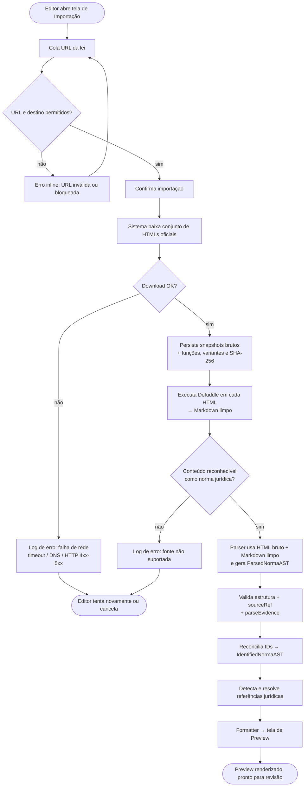
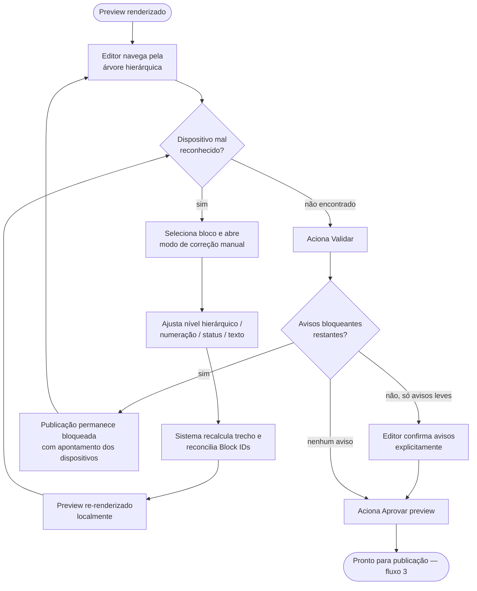
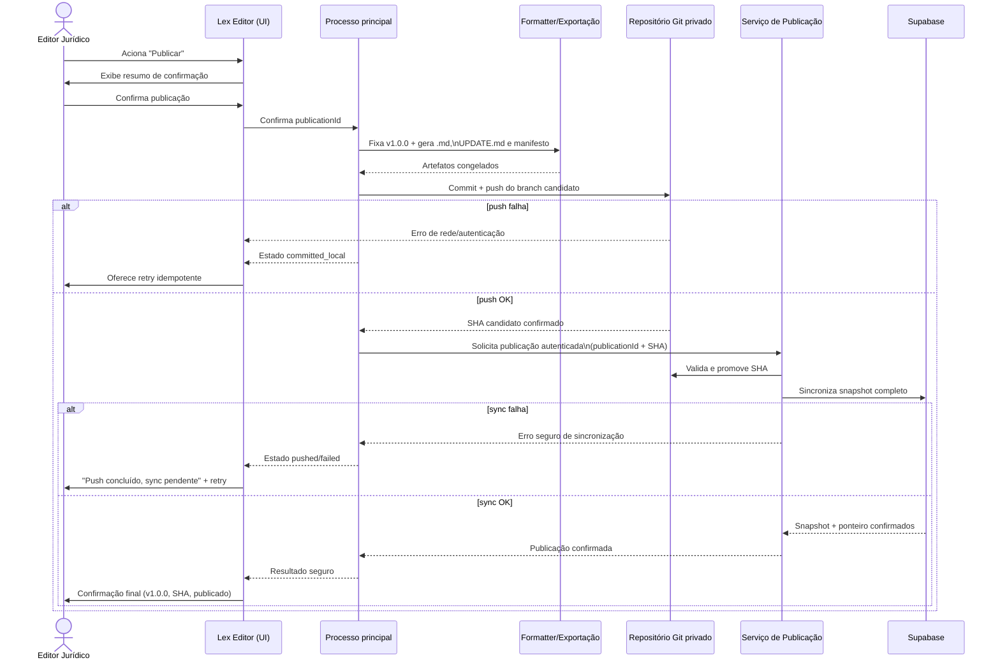
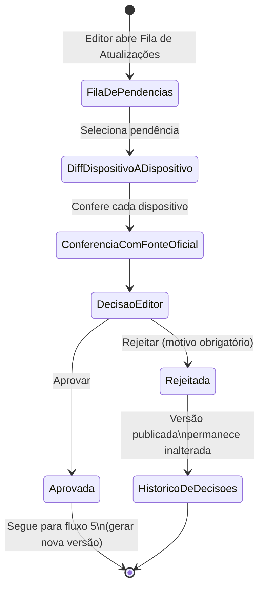
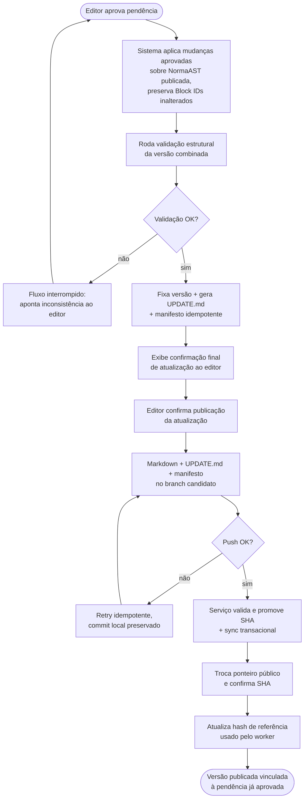
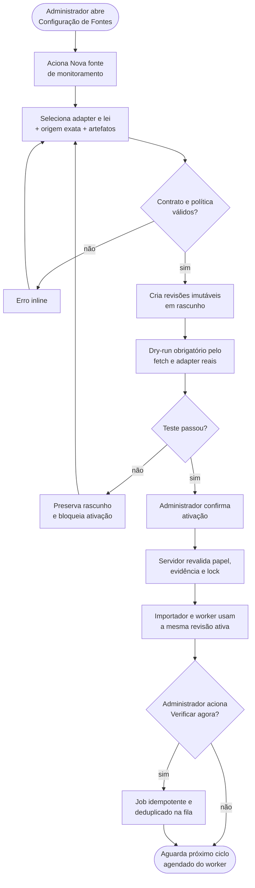
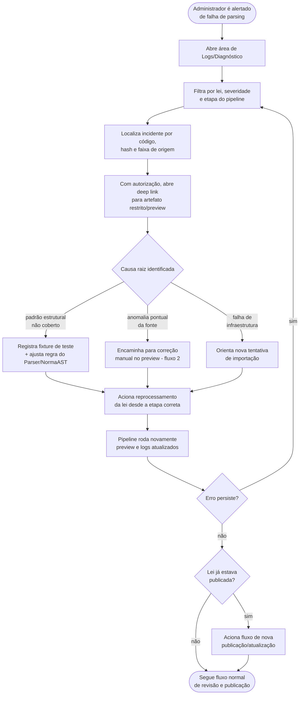
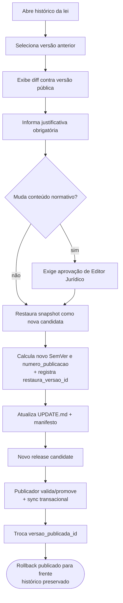
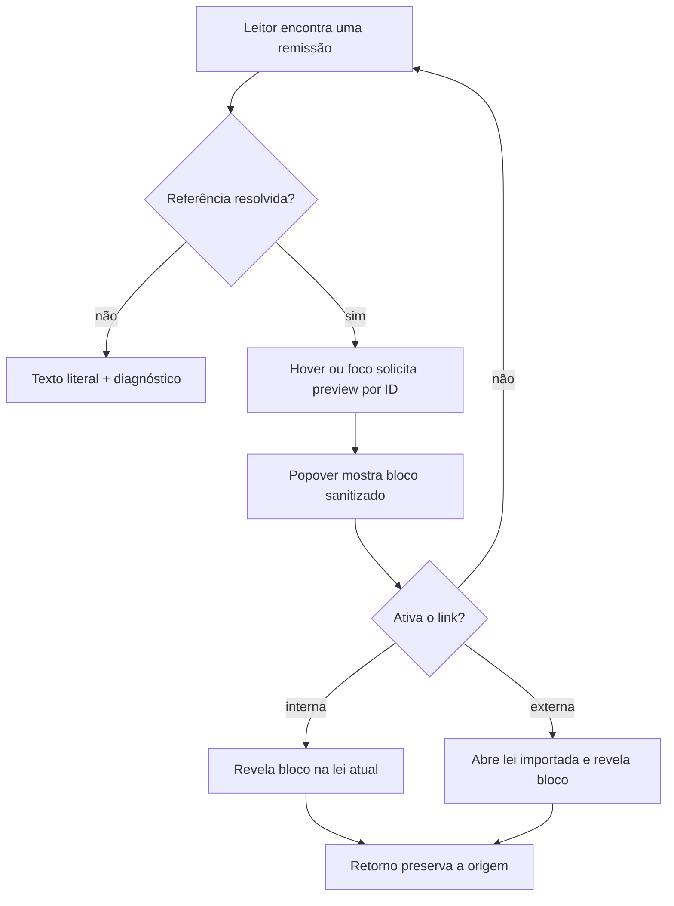

# Fluxos de Usuário — Lex Editor

> Referências: `../architecture/SYSTEM_ARCHITECTURE.md`, `../architecture/BLOCK_ID_SPEC.md`, `../architecture/MARKDOWN_SPEC.md`, `../architecture/UPDATE_PIPELINE.md`, `../architecture/ADR-013-referencias-juridicas-resolvidas.md`, `./ROADMAP.md`.
> Este documento descreve os fluxos operacionais do Lex Editor sob a ótica das duas personas internas: **Editor Jurídico** (revisa fidelidade do texto legal, aprova publicações e atualizações) e **Administrador Técnico** (configura fontes, monitora logs, resolve falhas de parsing). Cada fluxo traz passo a passo numerado (ação do usuário / resposta do sistema) e um diagrama Mermaid correspondente.

## Sumário

1. [Importar uma lei nova por URL](#1-importar-uma-lei-nova-por-url) — Editor Jurídico
2. [Revisar e corrigir o preview antes de publicar](#2-revisar-e-corrigir-o-preview-antes-de-publicar) — Editor Jurídico
3. [Publicar uma lei pela primeira vez](#3-publicar-uma-lei-pela-primeira-vez) — Editor Jurídico
4. [Revisar uma atualização legislativa detectada pelo worker](#4-revisar-uma-atualização-legislativa-detectada-pelo-worker) — Editor Jurídico
5. [Aprovar uma atualização e gerar nova versão](#5-aprovar-uma-atualização-e-gerar-nova-versão) — Editor Jurídico
6. [Configurar uma nova fonte de monitoramento](#6-configurar-uma-nova-fonte-de-monitoramento) — Administrador Técnico
7. [Investigar uma falha de parsing](#7-investigar-uma-falha-de-parsing) — Administrador Técnico
8. [Restaurar uma versão anterior](#8-restaurar-uma-versão-anterior) — Administrador Técnico
9. [Consultar uma referência jurídica](#9-consultar-uma-referência-jurídica) — Editor Jurídico

---

## 1. Importar uma lei nova por URL

**Persona:** Editor Jurídico
**Pré-condição:** Lex Editor aberto, tela de Importação acessível.
**Pós-condição de sucesso:** Preview da lei renderizado, pronto para revisão (fluxo 2).

### Passo a passo

1. O editor abre a tela de Importação e cola a URL da publicação oficial da lei (ex.: página do Código Penal no Planalto) no campo de entrada.
2. O sistema valida o formato e o perfil de fonte: somente `http`/`https`,
   host permitido/configurado e sem credenciais na URL. Antes de cada conexão e
   redirect, o processo principal resolve e bloqueia loopback, redes
   privadas/link-local e metadata de nuvem. URL inválida/proibida não dispara
   requisição.
3. O editor confirma a importação (botão "Importar").
4. O sistema exibe estado de carregamento na área de importação e registra o início do processo na área de logs ("Buscando conteúdo da fonte...").
5. O processo `main` faz o download com timeout, limite de redirects/tamanho,
   validação de tipo e TLS, sem encaminhar headers sensíveis entre origens. No
   Planalto, captura a página anotada/completa e também a compilada quando ela
   existir; persiste cada snapshot bruto separadamente, com função, variante,
   permissão restrita e SHA-256 próprios.
   - Se a requisição falha (timeout, host inexistente, HTTP 4xx/5xx, certificado inválido), o sistema interrompe o fluxo e exibe mensagem específica na área de logs e como toast/alerta (ex.: "Não foi possível acessar a fonte: tempo esgotado" ou "Fonte retornou erro 404"). O editor pode tentar novamente ou cancelar.
6. Com o conjunto de snapshots preservado, o sistema executa o Defuddle para
   produzir uma projeção em Markdown limpo de cada artefato.
   - Se o Defuddle retorna conteúdo vazio ou sem padrão reconhecível de norma jurídica (ex.: página de busca, texto institucional genérico do Planalto), o sistema classifica como "fonte não suportada/reconhecida" e interrompe antes de acionar o Parser, exibindo mensagem orientando o editor a verificar se a URL aponta diretamente para o texto da norma.
7. O adaptador Planalto recebe os HTMLs brutos e Markdown limpos, usa a fonte
   compilada como `primary_current` quando disponível e a anotada como
   `historical_auxiliary`, produz uma única `ParsedNormaAST` com `sourceRef`,
   `supportingSourceRefs` e `parseEvidence` por nó e a valida estruturalmente.
   O reconciliador então atribui ou reutiliza Block IDs, produz a
   `IdentifiedNormaAST` e o analisador deriva o índice de referências
   jurídicas. Apenas a árvore identificada e esse índice seguem para o
   Formatter.
   Todo o pipeline roda automaticamente, registrando progresso na área de logs
   (ex.: "347 dispositivos reconhecidos").
8. O sistema navega automaticamente para a tela de Preview, exibindo a lei
   completa por padrão e o painel de avisos de validação (mesmo que vazio). O
   editor pode alternar para a projeção somente vigente sem alterar ou
   reprocessar a NormaAST; estado desconhecido bloqueia essa projeção.
9. O editor passa a revisar o conteúdo (continua no fluxo 2).

### Diagrama

---

## 2. Revisar e corrigir o preview antes de publicar

**Persona:** Editor Jurídico
**Pré-condição:** Preview de uma lei recém-importada (ou reprocessada) está visível.
**Pós-condição de sucesso:** Todos os dispositivos identificados corretamente pelo editor, sem avisos bloqueantes pendentes, pronto para publicação (fluxo 3).

### Passo a passo

1. O editor navega pela árvore hierárquica do preview (livro/título/capítulo/seção/artigo) comparando visualmente com a fonte oficial aberta em paralelo, ou com o painel de avisos de validação como ponto de partida.
2. O editor identifica um dispositivo mal reconhecido — exemplos típicos: um inciso classificado como continuação do caput por erro de quebra de linha na fonte; um parágrafo cuja numeração foi lida incorretamente; um dispositivo revogado que não foi marcado como tal.
3. O editor seleciona o dispositivo no preview e aciona a ação de correção manual (modo de edição do bloco específico, não do documento inteiro).
4. O sistema exibe o texto bruto original correspondente lado a lado com a interpretação estrutural atual (nível hierárquico atribuído, Block ID provisório), permitindo ao editor:
   - reclassificar o nível hierárquico do bloco (ex.: de "continuação de caput" para "inciso próprio");
   - ajustar a numeração/identificador formal reconhecido (ex.: "VIII" em vez de "VII");
   - alterar `deviceStatus` entre `active`, `revoked` e `vetoed`, com
     justificativa editorial;
   - corrigir o texto literal apenas em caso de erro de transcrição do Defuddle (nunca para alterar o sentido jurídico do dispositivo).
5. O sistema recalcula apenas o trecho afetado da NormaAST e executa novamente
   a atribuição/reconciliação de Block IDs: candidatos ainda não publicados
   podem mudar; IDs já publicados são reutilizados do registro e permanecem
   congelados. Em seguida, re-renderiza o preview localmente.
6. O sistema registra a correção manual em log de auditoria interno (quem corrigiu, o quê, quando) — relevante para rastreabilidade de fidelidade jurídica.
7. O editor repete os passos 1–6 para cada dispositivo problemático encontrado.
8. Quando o editor considera a revisão completa, aciona "Validar" — o sistema roda o motor de regras de validação estrutural (Fase 6 do roadmap) e atualiza o painel de avisos:
   - se restarem avisos **bloqueantes**, a ação de publicar permanece desabilitada e o sistema aponta exatamente quais dispositivos exigem atenção;
   - se restarem apenas avisos **não bloqueantes**, o sistema permite prosseguir, mas exige confirmação explícita do editor reconhecendo os avisos.
9. Com validação limpa (ou avisos não bloqueantes confirmados), o editor aciona "Aprovar preview", habilitando o fluxo de publicação (fluxo 3).

### Diagrama

---

## 3. Publicar uma lei pela primeira vez

**Persona:** Editor Jurídico
**Pré-condição:** Preview aprovado (fluxo 2 concluído), sem avisos bloqueantes pendentes.
**Pós-condição de sucesso:** O SHA candidato foi promovido ao branch protegido
pelo Serviço de Publicação e o ponteiro público foi trocado pela transação no
Supabase, ambos confirmados na UI.

### Passo a passo

1. O editor aciona "Publicar" a partir do preview aprovado.
2. O sistema exibe uma tela de confirmação com resumo do que será publicado: nome da lei, quantidade de dispositivos, caminho de destino no repositório (`leis/<sigla>/`), e indicação de que se trata de primeira publicação (não atualização).
3. O editor confirma a publicação.
4. O sistema fixa `versao_vinculex = '1.0.0'` e
   `numero_publicacao = 1`, gera o Markdown, a entrada inicial de `UPDATE.md` e
   o manifesto com chave de idempotência e hashes. A confirmação do passo 3
   congela esses artefatos no diário local durável.
5. O sistema grava Markdown, `UPDATE.md` e manifesto no mesmo release commit
   (ex.: `publish(cp): v1.0.0 — publicação inicial`) e faz push ao branch
   candidato `releases/{publicationId}`.
   - Se o push falhar, mantém o estado `committed_local` e oferece retry com a
     mesma chave e o mesmo commit; a UI não usa a palavra “publicado”.
6. O Serviço de Publicação relê o SHA no Git, verifica aprovação server-side,
   identidade/papel, base, paths, manifesto e hashes, promove o SHA ao branch
   protegido e inicia o sync idempotente.
   - Se o sync falhar, mantém o estado “push concluído, sincronização
     pendente” e oferece retry com a mesma chave, versão, manifesto e SHA.
7. Em uma única transação, o Supabase cria a versão e todos os dispositivos,
   registra IDs/redirecionamentos e, por último, atualiza
   `leis.versao_publicada_id`.
8. Somente após o commit da transação o sistema exibe confirmação final:
   versão, número da publicação, commit SHA, estado “publicado” e horário.
9. A lei passa a aparecer na lista de leis publicadas do Lex Editor, disponível para consulta de histórico e, futuramente, para receber atualizações via worker (fluxos 4 e 5).

### Diagrama

---

## 4. Revisar uma atualização legislativa detectada pelo worker

**Persona:** Editor Jurídico
**Pré-condição:** Worker de atualização detectou divergência de hash em uma lei já publicada e gerou uma pendência na fila (ver `../architecture/UPDATE_PIPELINE.md`).
**Pós-condição de sucesso:** Editor tomou uma decisão explícita (aprovar ou rejeitar) documentada no sistema.

### Passo a passo

1. O editor percebe o indicador de pendências não revisadas na navegação do Lex Editor (contador visível) e abre a tela "Fila de Atualizações".
2. O sistema lista as pendências ordenadas (ex.: por data de detecção), cada uma identificando a lei afetada, a quantidade de dispositivos impactados e o tempo desde a detecção.
3. O editor seleciona uma pendência para revisão.
4. O sistema exibe a tela de diff dispositivo a dispositivo: para cada dispositivo afetado, mostra o texto da versão atualmente publicada ao lado do texto capturado da fonte oficial na nova verificação, com o Block ID preservado e visível (evidenciando que a posição jurídica não muda mesmo quando o texto muda) e uma classificação do tipo de mudança (`alterado`, `incluído`, `revogado`).
5. O editor confere cada dispositivo alterado contra a fonte oficial (link direto disponível na tela) para confirmar que a divergência é real e foi capturada corretamente.
6. Para cada dispositivo, o editor pode marcar concordância individual ou usar uma ação de decisão agregada para o conjunto da pendência.
7. Ao final da revisão de todos os dispositivos da pendência, o editor decide:
   - **Aprovar** — segue para o fluxo 5;
   - **Rejeitar** — o sistema solicita um motivo textual obrigatório (ex.: "divergência é apenas de formatação da fonte, sem mudança de mérito"), registra a rejeição associada à pendência e mantém a versão publicada atual inalterada; a pendência sai da fila ativa, mas permanece consultável no histórico de decisões.
8. O sistema confirma a decisão na UI e atualiza o contador de pendências.

### Diagrama

---

## 5. Aprovar uma atualização e gerar nova versão

**Persona:** Editor Jurídico
**Pré-condição:** Editor decidiu aprovar uma pendência de atualização (fluxo 4, passo 7).
**Pós-condição de sucesso:** `UPDATE.md` atualizado no mesmo release commit da
lei, nova versão ativada no Supabase e hash de referência do worker atualizado.

### Passo a passo

1. Ao confirmar "Aprovar" na tela de diff, o sistema reaproveita a NormaAST reprocessada pelo worker (já validada na revisão) e aplica as mudanças aprovadas sobre a NormaAST atualmente publicada, preservando Block IDs de dispositivos inalterados.
2. O sistema roda novamente o motor de validação estrutural (mesmo usado na primeira publicação) sobre o resultado combinado, para garantir que a atualização não introduziu inconsistências estruturais.
   - Se surgirem avisos bloqueantes, o fluxo é interrompido e devolvido ao editor com apontamento do problema, sem gerar commit.
3. Com validação limpa, o sistema calcula o próximo SemVer e
   `numero_publicacao`, gera a nova entrada do único changelog `UPDATE.md` e
   prepara o manifesto com hashes, commit-base e chave de idempotência.
4. O sistema apresenta ao editor a versão, o resumo de `UPDATE.md`, o diff e
   os arquivos/hashes que serão congelados.
5. O editor confirma a publicação da atualização.
6. O sistema cria um release commit único e o envia ao branch candidato, com o
   mesmo tratamento idempotente do fluxo 3.
7. O Serviço de Publicação revalida e promove o SHA ao branch protegido,
   sincroniza o snapshot completo em uma transação e troca o ponteiro ao final.
8. A decisão editorial já fica registrada como `approved` na confirmação do
   passo 5. Após o sucesso da transação, o sistema vincula a versão publicada à
   pendência e atualiza o hash de referência.
9. A UI confirma a publicação com SemVer, `numero_publicacao` e link para o
   release commit.

### Diagrama

---

## 6. Configurar uma nova fonte de monitoramento

**Persona:** Administrador Técnico
**Pré-condição:** Uma lei possui identidade cadastrada e o Administrador Técnico está autenticado com papel administrativo revalidado no servidor.
**Pós-condição de sucesso:** Revisões imutáveis de provedor e vínculo foram testadas e ativadas; importador e worker passam a consumir o mesmo conjunto versionado de artefatos.

### Passo a passo

1. O administrador técnico abre a tela "Configuração de fontes" no Lex Editor.
2. O sistema lista provedor, revisão, vínculo, conjunto de artefatos, frequência, última verificação e os estados separados de ativação e saúde.
3. O administrador aciona "Nova fonte oficial" e escolhe um adaptador já instalado.
4. O sistema solicita a lei, a origem exata normalizada, os parâmetros declarativos aceitos pelo adaptador, os artefatos com função/variante e a frequência. Não aceita credenciais, headers, regex, seletores ou código.
5. O sistema valida o contrato e cria revisões imutáveis de provedor e vínculo em rascunho.
6. O sistema executa obrigatoriamente um dry-run pelo mesmo fetch seguro, política de rede e adaptador usados pela importação e pelo worker.
   - Se o teste falhar, a revisão permanece como rascunho e não pode ser ativada.
   - Se o teste passar, o sistema exibe a evidência limitada e solicita confirmação explícita da ativação.
7. O administrador confirma; o servidor revalida papel, evidência, revisão e controle otimista, troca o ponteiro ativo e registra auditoria append-only.
8. O sistema confirma a ativação na UI. Importações futuras da URL e novos jobs do worker capturam a mesma revisão; jobs já iniciados não mudam no meio da execução.
9. O administrador pode pausar, arquivar ou restaurar uma revisão testada sem apagar histórico.
10. O administrador pode acionar "Verificar agora"; a solicitação é autenticada, idempotente, deduplicada e usa os mesmos limites do agendamento.

### Diagrama

---

## 7. Investigar uma falha de parsing

**Persona:** Administrador Técnico
**Pré-condição:** Uma importação ou reprocessamento gerou erro/aviso crítico registrado nos logs (ex.: lei não reconhecida corretamente, dispositivos ausentes, ou o worker sinalizou falha ao reprocessar uma fonte já monitorada).
**Pós-condição de sucesso:** Causa raiz identificada, correção aplicada (ajuste de regra do Parser, fixture de teste, ou intervenção pontual) e lei reprocessada com sucesso.

### Passo a passo

1. O administrador técnico é alertado (indicador de erro na navegação, ou notícia de falha reportada pelo Editor Jurídico) e abre a área de Logs/Diagnóstico do Lex Editor.
2. O sistema exibe o histórico de eventos de processamento filtrável por severidade (erro/aviso/info), por lei e por etapa do pipeline (Defuddle, Parser, NormaAST, Block ID, Formatter, Validação).
3. O administrador filtra pela lei/execução com falha e localiza a entrada de log correspondente, que inclui código do incidente, etapa, mensagem técnica redigida, hash do artefato e — quando aplicável — a faixa de origem que disparou a falha. Secrets, headers, HTML bruto e AST integral nunca entram no log ou no relatório de crash.
4. Se possuir autorização, o administrador usa o deep link para abrir sob demanda a faixa referenciada no artefato restrito, no Markdown intermediário ou no preview. O conteúdo bruto não é copiado para a telemetria e segue controle de acesso, retenção e auditoria.
5. O administrador avalia a causa raiz, tipicamente uma entre três categorias:
   - **Padrão estrutural não coberto pelas regras do Parser/NormaAST** (ex.: uma variação de formatação de inciso não prevista) — exige ajuste no motor de reconhecimento (mudança de código, fora do escopo de uma correção pontual no preview).
   - **Anomalia pontual da fonte** (ex.: erro de digitação ou HTML malformado específico daquela página) — pode ser resolvido com correção manual no preview (fluxo 2), sem necessidade de alterar regras gerais.
   - **Falha de infraestrutura** (rede, disponibilidade da fonte) — não é falha de parsing propriamente dita; o administrador apenas orienta nova tentativa de importação.
6. Caso a causa seja um padrão estrutural não coberto, o administrador registra o caso como uma nova fixture de teste (reaproveitando a suíte de testes unitários da NormaAST/Parser) para que a correção de regra seja validada e a regressão fique coberta permanentemente.
7. Após o ajuste (de regra de código, quando aplicável, ou de correção manual pontual pelo Editor Jurídico), o administrador aciona o **reprocessamento** da lei a partir da etapa correta (repetir desde a extração, se o problema estava no Parser; ou apenas regerar Block IDs/Markdown, se a NormaAST já estava correta e o problema era de formatação posterior).
8. O sistema roda novamente o pipeline a partir do ponto indicado e atualiza o preview/logs.
9. O administrador confirma nos logs que o erro não se repete e, se a lei já estava publicada, aciona o fluxo de nova publicação/atualização (fluxos 3 ou 5, conforme o caso) para que a correção chegue ao conteúdo publicado.

### Diagrama

---

## 8. Restaurar uma versão anterior

**Persona:** Administrador Técnico
**Pré-condição:** A lei possui ao menos duas publicações concluídas e uma
versão histórica íntegra no Git/Supabase.
**Pós-condição de sucesso:** O conteúdo escolhido foi restaurado como uma nova
publicação auditável, sem reescrever histórico.

### Passo a passo

1. O administrador abre o histórico da lei, ordenado por
   `numero_publicacao`, e escolhe uma `versoes_lei` anterior.
2. O sistema mostra o diff entre a versão pública corrente e o snapshot
   escolhido, incluindo efeitos sobre texto, hierarquia, estados e Block IDs.
3. O administrador informa justificativa obrigatória. Se o diff alterar
   conteúdo normativo, um Editor Jurídico deve aprovar antes de continuar.
4. O sistema restaura o snapshot escolhido como nova `IdentifiedNormaAST`;
   versões históricas e o registro append-only de IDs permanecem intocados.
5. O sistema calcula um novo SemVer a partir do diff contra a versão corrente
   (`MINOR` quando a projeção normativa muda; `PATCH` caso contrário), atribui
   novo `numero_publicacao` e registra `restaura_versao_id`.
6. Uma entrada de rollback é adicionada a `UPDATE.md`, identificando a versão
   restaurada, a justificativa e o responsável.
7. O fluxo normal usa a mesma chave: manifesto → branch candidato → validação e
   promoção server-side → sync transacional → troca do ponteiro público.
8. A UI confirma a nova publicação. O commit que causou o problema, a versão
   substituída e todos os eventos permanecem disponíveis para auditoria.

### Diagrama

---

## 9. Consultar uma referência jurídica

**Persona:** Editor Jurídico
**Pré-condição:** Preview de uma lei processada está aberto; a análise de
referências terminou.
**Pós-condição de sucesso:** O dispositivo mencionado foi lido ou aberto sem
perder a posição de origem.

### Passo a passo

1. O sistema realça somente menções com alvo resolvido por identidade de lei e
   Block ID. Menções ausentes ou ambíguas permanecem texto literal e aparecem
   no painel de validação.
2. Ao passar o cursor ou focar uma referência por teclado, o renderer solicita
   pelo ID opaco um preview ao processo principal.
3. O sistema exibe popover com lei, caminho jurídico, status e texto sanitizado
   do bloco exato. A operação é local e não acessa a fonte oficial.
4. `Escape` fecha o popover. Ao clicar ou acionar pelo teclado:
   - referência interna revela e focaliza o bloco na lei atual;
   - referência externa abre a lei importada e revela o bloco-alvo.
5. A navegação registra a origem para que o editor retorne ao ponto anterior.
6. Na exportação, o mesmo alvo vira wikilink para Block ID; links externos usam
   a raiz `VincuLex` e internos omitem o caminho da nota atual.

### Diagrama

