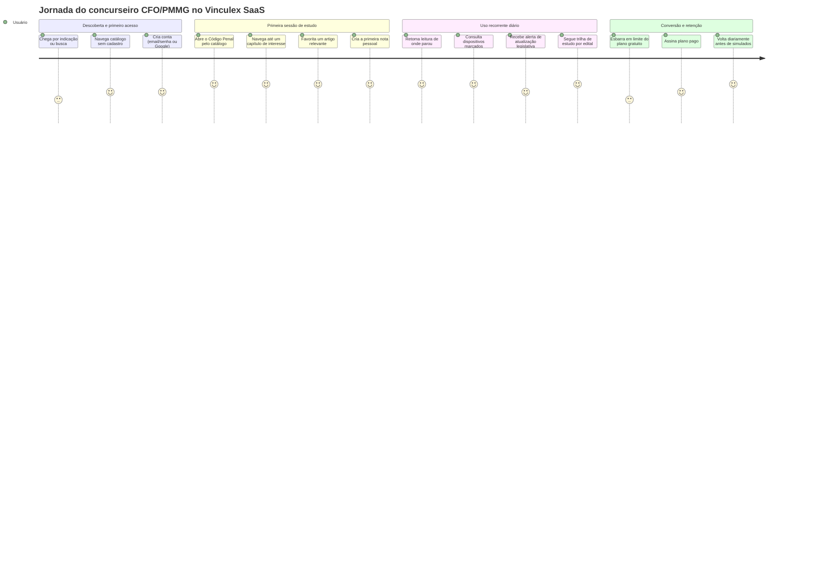
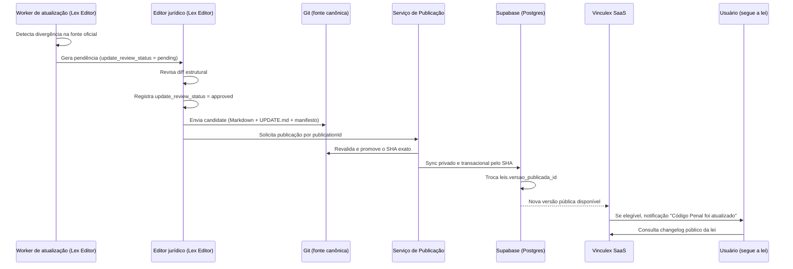

# PRD — Vinculex SaaS

> Versão 1.0 — substitui integralmente o rascunho anterior (`vinculex/PRD-2.0-Vinculex-SaaS.md`), que continha apenas placeholders. Este documento é a especificação de produto de referência do Vinculex SaaS.
>
> Este PRD cobre exclusivamente o **Vinculex SaaS** (plataforma web de consumo). O Lex Editor (app desktop de importação, parsing e publicação de legislação) tem PRD próprio em `../lex-editor/PRD.md` e não é objeto deste documento.

## Sumário

1. [Visão Geral](#visão-geral)
2. [Objetivos Estratégicos](#objetivos-estratégicos)
3. [Personas](#personas)
4. [Jornada do Usuário](#jornada-do-usuário)
5. [Casos de Uso](#casos-de-uso)
6. [Biblioteca Jurídica](#biblioteca-jurídica)
7. [Navegação](#navegação)
8. [Pesquisa](#pesquisa)
9. [Favoritos](#favoritos)
10. [Notas](#notas)
11. [Progresso](#progresso)
12. [Marcações](#marcações)
13. [Atualizações Legislativas](#atualizações-legislativas)
14. [Trilhas de Estudo](#trilhas-de-estudo)
15. [Dashboard](#dashboard)
16. [Administração](#administração)
17. [Modelo de Dados](#modelo-de-dados)
18. [APIs](#apis)
19. [Segurança](#segurança)
20. [Autenticação](#autenticação)
21. [Assinaturas](#assinaturas)
22. [Performance](#performance)
23. [Roadmap](#roadmap)
24. [Métricas](#métricas)
25. [Critérios de Aceite](#critérios-de-aceite)
26. [Riscos](#riscos)
27. [ADRs Relacionados](#adrs-relacionados)
28. [Requisitos Funcionais](#requisitos-funcionais)
29. [Requisitos Não Funcionais](#requisitos-não-funcionais)

---

## Visão Geral

O Vinculex SaaS é a plataforma web onde estudantes de concursos, estudantes
de Direito e operadores do Direito consultam legislação brasileira
estruturada e validada. O SaaS **não faz parsing, não gera Markdown e não
escreve conteúdo normativo**: o Lex Editor prepara o release candidate e o
Serviço de Publicação server-side revalida, promove e sincroniza o snapshot.
O SaaS consome apenas projeções públicas da versão indicada por
`leis.versao_publicada_id` (ver ADR-005 e ADR-007).

A proposta de valor central do produto tem três pilares:

1. **Leitura estruturada em vez de texto corrido.** Em vez de PDFs ou páginas de legislação com formatação inconsistente (como o site do Planalto), o usuário navega uma hierarquia jurídica real — capítulo, seção, artigo, parágrafo, inciso, alínea — com links internos entre dispositivos e âncoras compartilháveis por Block ID.
2. **Anotações que sobrevivem a atualizações legislativas.** Favoritos, notas e marcações são vinculados ao Block ID do dispositivo (não ao texto nem à posição), então continuam válidos mesmo quando uma lei é alterada e republicada pelo Lex Editor (ver ADR-001).
3. **Confiabilidade herdada do pipeline editorial.** Nada aparece no Vinculex SaaS sem ter passado por aprovação humana no Lex Editor e por publicação formal (ver ADR-003 e ADR-004) — o usuário nunca vê uma interpretação de parser não revisada.

O produto é desenhado mobile-first porque o público principal (concurseiros) estuda em trânsito — ônibus, fila, intervalo de trabalho — e o hábito de consulta rápida de um dispositivo específico é tão importante quanto a leitura de estudo mais longa em casa.

---

## Objetivos Estratégicos

- **Substituir a consulta fragmentada em PDF/site oficial** pelo hábito de consulta estruturada no Vinculex, tornando-se a referência diária de legislação para concurseiros de carreiras policiais/militares, com foco inicial em CFO/PMMG.
- **Transformar leitura passiva em dado de estudo.** Progresso de leitura, favoritos, notas e marcações não são apenas conveniência — são o ativo de engajamento que sustenta retenção e justifica a conversão para o plano pago.
- **Fechar o loop de atualização legislativa** entre Lex Editor e usuário final: quando uma lei que o usuário acompanha muda, ele é notificado automaticamente, sem precisar monitorar a fonte oficial manualmente.
- **Preservar 100% da fidelidade jurídica herdada do pipeline editorial**, nunca expondo conteúdo em `draft`, `review` ou `approved` — apenas `published` chega ao usuário final.
- **Construir a base de dados de uso** (progresso, marcações, trilhas seguidas) que sustenta iniciativas futuras de recomendação de conteúdo e priorização de revisão, mesmo que essas iniciativas estejam fora do escopo do MVP.
- **Validar um modelo de assinatura sustentável** para um produto de nicho (concursos policiais/militares) sem depender de volume massivo, priorizando retenção e valor percebido sobre aquisição pura.

---

## Personas

### Persona primária — Concurseiro(a) CFO/PMMG

Candidato ao Curso de Formação de Oficiais da Polícia Militar de Minas Gerais, estudando em paralelo a um emprego ou faculdade, com rotina de estudo fragmentada em blocos curtos ao longo do dia (deslocamento, intervalos, fim de noite).

**Rotina de estudo típica:**

- Estuda por edital, seguindo um cronograma próprio ou de curso preparatório, com disciplinas como Código Penal, Código de Processo Penal, Constituição Federal, Direito Administrativo, Direito Constitucional, ECA, CTB e Lei 14.133/2021.
- Alterna entre videoaula, resumo em caderno/Notion e leitura da lei seca — a leitura da lei seca costuma ser a etapa mais penosa e mais adiada.
- Revisa dispositivos específicos repetidamente ao longo de semanas (ex.: os incisos do art. 121 do CP, ou o rol do art. 5º da CF/88), porque bancas de concurso cobram redação literal com frequência.
- Estuda em trajetos de transporte público ou em intervalos curtos no celular, e à noite revisa de forma mais aprofundada em notebook ou tablet.

**Dores específicas de estudar legislação em PDF/site oficial:**

- PDFs de leis longas (CF/88, CP, CTB) não têm navegação estruturada — rolar até um artigo específico é lento, e a busca por texto do leitor de PDF traz ruído (repete o mesmo termo dezenas de vezes sem contexto de hierarquia).
- O site do Planalto mistura o texto vigente com notas de rodapé de revogação em formatação inconsistente entre leis, dificultando saber rapidamente se um dispositivo ainda está em vigor.
- Anotações feitas em PDF (grifos, comentários) não sobrevivem quando o candidato baixa uma versão atualizada do arquivo após uma alteração legislativa — o trabalho de grifar e comentar se perde e precisa ser refeito.
- Não há como marcar "isso cai muito em prova" e revisitar rapidamente esse subconjunto de dispositivos depois — cada revisão exige procurar o mesmo trecho de novo.
- Não existe noção de progresso: o candidato não sabe objetivamente quanto da lei já revisou, o que gera ansiedade quanto ao proprio ritmo de estudo.

**O que motiva uso diário do produto:**

- Retomar de onde parou (progresso salvo por lei) sem precisar lembrar manualmente até onde já revisou.
- Acesso rápido a dispositivos marcados como "cobrança frequente" antes de simulados.
- Confiança de estar lendo o texto vigente e atualizado, sem precisar checar manualmente se uma lei mudou.
- Notas pessoais (macetes de decoreba, referências cruzadas com jurisprudência ou súmulas) vinculadas ao dispositivo exato, disponíveis em qualquer dispositivo, sem depender de um caderno físico ou de um arquivo local.

### Persona secundária — Estudante de Direito

Cursando graduação em Direito, usa o Vinculex principalmente para leitura de dispositivos indicados em aula ou para preparar trabalhos e provas de disciplinas como Direito Penal, Processo Penal, Direito Constitucional e Direito Administrativo. Menor intensidade de uso diário que o concurseiro CFO/PMMG, mas maior profundidade pontual (lê comentários e faz anotações mais longas). Beneficia-se da navegação estruturada e da busca por artigo específico, mas tem menor necessidade de trilhas de estudo estruturadas por edital.

### Persona secundária — Advogado(a) / Servidor(a) Público(a) / Professor(a)

Usa o Vinculex como ferramenta de consulta profissional rápida (advogado(a) verificando redação exata de um dispositivo antes de uma petição; servidor(a) público(a) aplicando Lei 14.133/2021 no dia a dia de licitações; professor(a) preparando aula e compartilhando um link direto para um dispositivo específico com a turma). Valoriza sobretudo a URL compartilhável por Block ID, a certeza de estar lendo o texto vigente e a velocidade de busca — menos interessado em trilhas de estudo ou gamificação de progresso.

---

## Jornada do Usuário

A jornada de alto nível cobre do primeiro acesso ao uso recorrente diário. O detalhamento completo de cada fluxo (telas, estados de erro, pontos de decisão) está em `./USER_FLOWS.md`.



Pontos de alto valor na jornada: o momento em que o usuário retoma a leitura exatamente de onde parou (progresso salvo) e o momento em que uma nota antiga permanece válida após uma atualização legislativa — ambos reforçam diretamente a proposta de valor central do produto.

---

## Casos de Uso

- Como **concurseiro CFO/PMMG**, quero me cadastrar rapidamente com email/senha ou Google, para começar a estudar sem fricção.
- Como **concurseiro CFO/PMMG**, quero buscar "art. 121 CP" e ir direto ao dispositivo, para não perder tempo navegando manualmente.
- Como **estudante de Direito**, quero ler a Constituição Federal com sua hierarquia completa (título, capítulo, seção, artigo), para entender a organização sistemática do texto, não só o artigo isolado.
- Como **concurseiro CFO/PMMG**, quero favoritar o art. 5º da CF/88 inteiro, para revisá-lo com frequência sem precisar buscar de novo.
- Como **concurseiro CFO/PMMG**, quero criar uma nota pessoal vinculada a um inciso específico do art. 121 do CP, para registrar um macete de memorização que uso nas revisões.
- Como **concurseiro CFO/PMMG**, quero marcar um dispositivo como "cobrança frequente", para montar rapidamente uma lista de revisão de última hora antes da prova.
- Como **concurseiro CFO/PMMG**, quero acompanhar meu percentual de leitura do Código de Trânsito Brasileiro, para saber quanto falta e organizar meu cronograma.
- Como **concurseiro CFO/PMMG**, quero ser notificado quando o ECA que estou estudando for atualizado, para não estudar por um texto desatualizado sem saber.
- Como **estudante de Direito**, quero seguir uma trilha pública "Direito Administrativo — Fundamentos", para ter uma ordem de leitura curada em vez de decidir sozinho por onde começar.
- Como **servidor(a) público(a)**, quero compartilhar um link direto para o art. 75 da Lei 14.133/2021, para apontar um colega exatamente ao dispositivo em discussão.
- Como **advogado(a)**, quero ter certeza de que o texto que estou lendo é a versão vigente e publicada, para não citar um dispositivo revogado por engano.
- Como **usuário assinante**, quero exportar minhas notas pessoais, para ter uma cópia própria dos meus apontamentos de estudo fora da plataforma.

---

## Biblioteca Jurídica

A Biblioteca Jurídica é o catálogo de leis do Vinculex SaaS, com duas formas
de navegação e uma busca complementar:

- **Por ramo do direito** — agrupamento editorial (Direito Penal, Direito Processual Penal, Direito Constitucional, Direito Administrativo, Direito da Criança e do Adolescente, Direito de Trânsito, Licitações e Contratos), correspondente ao campo `leis.ramo`.
- **Por sigla** — busca direta por sigla conhecida (CP, CPP, CF88, ECA, CTB), correspondente ao campo `leis.sigla`, útil para quem já sabe exatamente qual lei quer abrir.
- **Por assunto** — pesquisa textual sobre títulos e conteúdo publicado. O MVP
  não promete uma taxonomia editorial de assuntos: `tags` ainda não integram
  a projeção pública persistida. Uma taxonomia futura exige contrato e
  indexação próprios.

Regra de negócio central do catálogo: **toda consulta à Biblioteca Jurídica filtra exclusivamente leis com `publication_status = 'published'`**. Uma lei em `draft`, `review`, `approved`, `archived` ou `outdated` nunca aparece no catálogo público, independentemente do estado de autenticação do usuário — não existe modo "preview" de conteúdo não publicado no SaaS (ver ADR-004 e ADR-005). Leis com `legal_status` diferente de `vigente` (ex.: `revogada`) permanecem visíveis no catálogo, mas com sinalização visual clara de que não estão mais em vigor — útil para consulta histórica, mas nunca ambíguo quanto à vigência atual.

---

## Navegação

A leitura estruturada de uma lei publicada segue a hierarquia real do dispositivo, refletindo `dispositivos.parent_id`:

```
Lei (ex.: Código Penal)
 └─ Livro (quando existir)
     └─ Título
         └─ Capítulo
             └─ Seção
                 └─ Artigo
                     └─ Parágrafo
                         └─ Inciso
                             └─ Alínea
                                 └─ Item
```

Requisitos de navegação:

- **Árvore navegável lateral**, com colapso/expansão por nível, permitindo ir direto a um capítulo ou artigo sem rolar o documento inteiro.
- **Links internos entre dispositivos**: uma remissão no texto (ex.: "nos termos do art. 61, II") é renderizada como link clicável para o Block ID correspondente, quando esse vínculo já está mapeado no conteúdo publicado.
- **Breadcrumb** exibindo o caminho hierárquico completo do dispositivo atual (ex.: `Código Penal > Parte Especial > Título I — Dos Crimes Contra a Pessoa > Capítulo I > Art. 121`).
- **Deep links por Block ID compartilháveis.** A URL canônica de dispositivo é
  `/leis/{sigla}/dispositivos/{block_id}`, por exemplo
  `/leis/cp/dispositivos/cp-art-121-par-2-inc-viii`. O valor de domínio não
  contém `^`; esse prefixo existe somente no Markdown/Obsidian. A rota chama o
  resolvedor server-side: um ID histórico recebe redirect permanente para o
  destino canônico; ID inexistente recebe 404. Dentro da página, o mesmo valor
  pode ser usado como `id` HTML para scroll local.
- **Indicação visual de `device_status`**: dispositivos `revoked` ou `vetoed` são exibidos com tachado e nota explicativa (`nota_status`); dispositivos `amended` exibem indicação de "redação dada por" quando disponível.

---

## Pesquisa

O Vinculex SaaS oferece quatro modos de busca:

- **Texto integral** — pesquisa livre sobre o conteúdo de todos os dispositivos publicados (ex.: buscar "elementar do tipo" e encontrar ocorrências em múltiplas leis).
- **Número de artigo** — busca direta e determinística por combinação sigla + número (ex.: "art. 157 CP", "art. 5º CF"), com resolução exata sem depender de ranking de relevância.
- **Assunto** — busca textual por expressões temáticas (ex.: "crimes contra o patrimônio", "prazo processual"), sem semântica de tag no MVP.
- **Palavra-chave com filtro por ramo/lei** — busca livre restrita a um ramo do direito ou a uma lei específica, para reduzir ruído quando o usuário já sabe o contexto.

**Decisão de arquitetura para o MVP: full-text search nativo do Postgres (Supabase), não um serviço de busca dedicado.**

Justificativa:

- O volume de conteúdo do MVP é conhecido e limitado (o catálogo inicial cobre um conjunto finito de leis do foco CFO/PMMG — CF/88, CP, CPP, ECA, CTB, Lei 14.133/2021, legislação de Direito Administrativo e Constitucional correlata), muito abaixo do ponto em que a latência do `tsvector`/GIN do Postgres se torna um gargalo real.
- `tsvector` com dicionário `portuguese`, extensão `unaccent` e índice GIN
  cobrem texto/assunto; a consulta pública sempre cruza
  `leis.versao_publicada_id`, de modo que snapshots históricos nunca aparecem
  no resultado.
- Busca por número de artigo não depende de full-text search — é uma consulta direta e indexada por `leis.sigla` + `dispositivos.numero`, portanto o caso de uso mais frequente do concurseiro (ir direto ao art. X) já é resolvido com latência mínima independentemente da estratégia de texto livre.
- Evita acoplar o MVP à operação de um serviço adicional (ex.: Meilisearch, Algolia, Typesense), reduzindo superfície operacional em um momento em que o time é pequeno e o produto ainda valida product-market fit.

Ponto de reavaliação explícito: se o catálogo crescer para o acervo completo de legislação federal e estadual relevante, ou se a busca por texto livre em textos jurídicos longos (com muita repetição terminológica) apresentar ranking de relevância insatisfatório mesmo com `ts_rank`, a migração para um serviço de busca dedicado (ex.: Meilisearch, por ter suporte nativo a português e ser open-source) é a evolução natural — decisão a ser revisitada em ADR próprio quando o volume justificar.

---

## Favoritos

O usuário pode favoritar tanto um **dispositivo específico** (ex.: art. 33, § 4º da Lei de Drogas) quanto uma **lei inteira** (ex.: favoritar o Código de Trânsito Brasileiro como um todo, para acompanhamento geral). Favoritos podem ser organizados em **coleções** definidas pelo próprio usuário (ex.: "Revisão final — Penal", "Dispositivos que sempre erro"), com um favorito podendo pertencer a mais de uma coleção.

O schema de dados (tabelas `favoritos`, `colecoes`, `favoritos_colecao`) está especificado em `../architecture/DATA_MODEL.md`, que também documenta a política de RLS restringindo leitura e escrita de favoritos ao próprio `user_id` (`auth.uid() = user_id`). Este PRD não redefine esse schema — referencia-o como fonte de verdade estrutural.

Regra de estabilidade: favoritos referenciam `block_id`, não
`dispositivos.id`, e guardam `versao_lei_id_criacao`. O vínculo sobrevive à
troca de versão e à renumeração via resolvedor de aliases; o snapshot de
criação permite determinar se houve atualização desde o favorito.

---

## Notas

Nota pessoal de texto livre, vinculada a um `block_id` específico, visível apenas para o próprio usuário. O editor de notas suporta **Markdown básico** (negrito, itálico, listas, links, blocos de citação) — suficiente para os macetes e resumos que o concurseiro costuma registrar, sem a complexidade de um editor rich-text completo.

Como a nota é vinculada ao `block_id`, ela sobrevive a atualizações
legislativas. `versao_lei_id_criacao` registra qual snapshot estava visível
quando a nota nasceu; comparando o texto desse snapshot com o texto público
atual, o SaaS só mostra “texto atualizado desde sua nota” quando aquele
dispositivo realmente mudou — não apenas porque a lei ganhou uma versão.

Schema de dados (tabela `notas`) especificado em `../architecture/DATA_MODEL.md`.

---

## Progresso

O Vinculex rastreia progresso de leitura por lei, com granularidade por dispositivo:

- **Percentual de conclusão por lei** — proporção de artigos ativos da versão
  pública atual que possuem ao menos um evento explícito de leitura do
  usuário; divisões, parágrafos e artigos revogados não entram no denominador.
- **Sequência de dias de estudo (streak)** — dias consecutivos com pelo menos
  um evento explícito em `eventos_leitura`.
- **Marcação de leitura no MVP é manual**, pelo botão “marcar artigo como
  lido”. Heurísticas de permanência/scroll ficam fora do MVP para evitar
  falsos positivos.

Exibição no dashboard: barra de progresso por lei em estudo ativo, streak atual em destaque (ex.: "7 dias seguidos"), e indicação de qual foi a última lei/dispositivo acessado, para retomada imediata. Schema de dados (`progresso_leitura`) especificado em `../architecture/DATA_MODEL.md`.

---

## Marcações

Marcações são **tags rápidas de triagem de estudo**, aplicadas a um dispositivo específico, com quatro valores possíveis: `importante`, `revisar`, `duvida`, `cobranca_frequente`. Diferente de favoritos e notas:

| Recurso | Propósito | Conteúdo | Uso típico |
|---|---|---|---|
| Favorito | Guardar para acesso rápido | Nenhum (booleano + coleção opcional) | "Quero achar isso de novo facilmente" |
| Nota | Registrar conhecimento próprio | Texto livre em Markdown | "Quero anotar um macete ou explicação" |
| Marcação | Classificar rapidamente para triagem de revisão | Uma tag fixa entre quatro valores | "Quero sinalizar o tipo de atenção que este dispositivo exige" |

Um mesmo dispositivo pode ter favorito, nota e marcação simultaneamente e de forma independente — são três eixos de metadado do usuário, não estados mutuamente exclusivos. A vantagem prática de marcações sobre notas para o caso de uso de revisão de véspera de prova é a agregação: o usuário filtra "mostrar todos os dispositivos marcados como `cobranca_frequente` em Direito Penal" e obtém uma lista de revisão instantânea, sem precisar abrir nota por nota. Schema de dados (`marcacoes`) especificado em `../architecture/DATA_MODEL.md`.

---

## Atualizações Legislativas

O Vinculex SaaS nunca detecta nem processa atualizações legislativas diretamente — essa responsabilidade é do worker de atualização do Lex Editor (`../architecture/UPDATE_PIPELINE.md`). O papel do SaaS é exclusivamente **consumir e notificar** o que já foi aprovado e publicado.

Fluxo de ponta a ponta relevante para o SaaS:



Pontos centrais de regra de negócio:

- **A atualização só aparece no SaaS depois de aprovada e publicada** — nunca antes. Uma pendência em `update_review_status = pending`, `rejected` ou mesmo `approved`-mas-ainda-não-sincronizada é completamente invisível ao SaaS (ver ADR-004, ADR-005).
- **Changelog público por lei** usa `api.changelog_publico`: `changelog` traz
  o resumo equivalente ao `UPDATE.md`, enquanto `mudancas` fornece listas
  estruturadas de Block IDs incluídos, alterados, revogados e renumerados.
  A ordem autoritativa é `numero_publicacao DESC`.
- **Notificação ao usuário** dispara somente após a troca de
  `leis.versao_publicada_id`, para a união idempotente de usuários que
  favoritaram a lei, possuem progresso nela ou têm uma trilha ativa que a
  contém e possuem entitlement Premium vigente. Criar `versoes_lei` sem
  ativar o ponteiro não notifica; usuários gratuitos continuam vendo o
  changelog público.
- Quando uma nova versão é publicada, dispositivos existentes preservam Block ID (ver ADR-001), então notas e favoritos do usuário permanecem associados corretamente sem nenhuma ação do usuário — a notificação existe para informar, não para exigir migração manual de dados do usuário.

---

## Trilhas de Estudo

Trilhas são sequências curadas de dispositivos/leis, com dois tipos:

- **Trilhas públicas curadas pela equipe editorial** — sequência recomendada de estudo por edital ou por disciplina, mantida pela equipe do Vinculex, visível a todos os usuários (leitura livre no plano gratuito, uso ativo com progresso rastreado no plano pago — ver capítulo Assinaturas).
- **Trilhas privadas criadas pelo usuário** — sequência personalizada, visível apenas ao criador, útil para reorganizar o estudo conforme o próprio cronograma ou o edital de um concurso específico.

Exemplo de trilha pública — "Direito Penal para CFO/PMMG":

| Ordem | Item da trilha | Observação |
|---|---|---|
| 1 | CP — Título I, Cap. I (Dos Crimes Contra a Pessoa), arts. 121 a 128 | Alta incidência em provas de carreiras policiais |
| 2 | CP — Título II (Dos Crimes Contra o Patrimônio), arts. 155 a 183 | Foco em furto, roubo e extorsão |
| 3 | CP — Parte Geral, arts. 13 a 25 (nexo causal, dolo, culpa, excludentes) | Base teórica cobrada de forma combinada com casos concretos |
| 4 | CP — Título XI (Dos Crimes Contra a Administração Pública), arts. 312 a 337 | Relevante para a atuação policial-militar |
| 5 | Legislação penal especial de maior incidência no edital (ex.: Lei de Drogas, Estatuto do Desarmamento) | Complementar ao Código Penal |

Schema de dados (`trilhas_estudo`, `trilha_itens`) especificado em `../architecture/DATA_MODEL.md`. A curadoria pública vive no próprio SaaS, em `/admin/trilhas`, entregue junto desta funcionalidade e protegida por `papel IN ('curador', 'administrador')` e `account_status = 'active'`. Ela não faz parte do Lex Editor nem concede escrita sobre conteúdo normativo.

---

## Dashboard

Tela inicial do usuário autenticado, com quatro blocos:

- **Progresso** — barra de conclusão da(s) lei(s) em estudo ativo, streak de dias consecutivos, atalho "continuar de onde parei".
- **Favoritos recentes** — últimos dispositivos/leis favoritados, com acesso rápido.
- **Atualizações relevantes** — notificações não lidas de leis acompanhadas
  por favorito, progresso ou trilha ativa.
- **Trilha ativa** — próximo item pendente da trilha de estudo em andamento (pública ou privada), com indicação de progresso dentro da trilha.

O dashboard é a tela padrão pós-login e é desenhado para responder em poucos segundos à pergunta "onde eu parei e o que eu faço agora" — reforçando o hábito diário que é central à retenção do produto.

---

## Administração

Painel restrito à equipe interna do Vinculex (perfil administrativo, não disponível a usuários finais), cobrindo:

- **Gestão de usuários** — busca, visualização de perfil, suporte a problemas de acesso, bloqueio/desbloqueio de conta em caso de abuso.
- **Gestão de assinaturas** — visualização de `subscription_status` por usuário, histórico de cobrança (via integração com processador de pagamento), suporte a cancelamentos e reembolsos.
- **Estatísticas de uso** — métricas agregadas (DAU/MAU, leis mais lidas,
  conversão, uso de favoritos/notas). Texto de busca não é persistido no
  schema transacional.
- **Visualização de conteúdo publicado** — visão somente leitura do catálogo tal como aparece para o usuário final, útil para suporte e QA ("o usuário está vendo a versão certa da lei?").

**Fora de escopo explícito do painel administrativo do Vinculex SaaS**:
edição normativa, aprovação editorial e alteração direta de assinatura. O
painel lê conteúdo somente pelas projeções públicas e solicita
cancelamento/reembolso ao provedor; `subscription_status` muda exclusivamente
por webhook verificado. O painel nunca recebe acesso às tabelas editoriais.

---

## Modelo de Dados

O schema completo das tabelas específicas do Vinculex SaaS está especificado em `../architecture/DATA_MODEL.md`, que é a fonte de verdade estrutural compartilhada entre Lex Editor e Vinculex SaaS. Este PRD referencia essas tabelas por nome, sem redefinir SQL:

- `favoritos` e `colecoes` / `favoritos_colecao` — favoritos individuais e sua organização em coleções (capítulo Favoritos).
- `notas` — anotações pessoais vinculadas a `block_id` (capítulo Notas).
- `marcacoes` — tags rápidas de triagem (`importante`, `revisar`, `duvida`, `cobranca_frequente`) (capítulo Marcações).
- `progresso_leitura` — tracking de leitura e streak (capítulo Progresso).
- `eventos_leitura` — eventos explícitos e append-only por artigo.
- `trilhas_estudo` / `trilha_itens` / `trilhas_usuario` — definição, itens,
  adoção e trilha ativa.
- `notificacoes` — notificações idempotentes por usuário e versão publicada.
- `assinaturas` — estado de assinatura do usuário, incluindo o campo `subscription_status` (capítulo Assinaturas).
- `eventos_gateway_pagamento` — inbox privada e append-only para deduplicação e reconciliação dos eventos Asaas.
- `auditoria_admin` — eventos administrativos append-only.
- `usuarios_perfil` — perfil, preferências, `papel` e `account_status`; os dois
  últimos só mudam por função administrativa auditada.

Cada tabela segue a matriz de grants/RLS de `DATA_MODEL.md`: dados pessoais
são lidos pelo próprio usuário, mas campos derivados e de autoridade têm
escrita mais restrita. Progresso agregado, notificações e assinatura são
mantidos por funções/jobs/webhooks; trilhas públicas têm regra própria. O
usuário nunca escreve conteúdo normativo.

---

## APIs

O frontend Next.js consome o Supabase via SDK (`@supabase/supabase-js`), encapsulado em hooks TanStack Query por domínio. Não há uma camada de API REST/GraphQL própria no MVP — a superfície de contrato é o conjunto de hooks abaixo, que ilustra o padrão adotado (lista não exaustiva):

```typescript
// Leitura de catálogo e conteúdo publicado

/** Busca uma lei publicada por sigla, com sua árvore de dispositivos. */
function useLeiBySigla(sigla: string): UseQueryResult<LeiComDispositivos>;

/** Resolve canônico/alias no servidor e retorna o dispositivo público. */
function useDispositivoByBlockId(params: {
  leiSigla: string;
  blockId: string;
}): UseQueryResult<{
  requestedBlockId: string;
  canonicalBlockId: string;
  equivalentBlockIds: string[];
  redirected: boolean;
  dispositivo: DispositivoDetalhado;
}>;

/** Busca textual (full-text) com filtros opcionais de ramo/lei. */
function useBuscaTextual(params: {
  termo: string;
  ramo?: string;
  leiSigla?: string;
}): UseQueryResult<ResultadoBusca[]>;

/** Changelog público com resumo e Block IDs afetados estruturados. */
function useChangelogLei(leiId: string): UseQueryResult<ChangelogEntry[]>;

// Favoritos e coleções

type FavoritoInput =
  | { tipoFavorito: 'lei'; leiId: string }
  | { tipoFavorito: 'dispositivo'; leiId: string; blockId: string };

function useFavoritar(): UseMutationResult<void, Error, FavoritoInput>;
function useDesfavoritar(): UseMutationResult<void, Error, { favoritoId: string }>;
function useColecoes(): UseQueryResult<Colecao[]>;
function useCriarColecao(): UseMutationResult<Colecao, Error, { nome: string }>;

// Notas

function useNotasPorDispositivo(params: {
  leiId: string;
  blockId: string;
}): UseQueryResult<Nota[]>;
function useCriarNota(): UseMutationResult<Nota, Error, { blockId: string; leiId: string; conteudo: string }>;
function useEditarNota(): UseMutationResult<Nota, Error, { notaId: string; conteudo: string }>;
function useExcluirNota(): UseMutationResult<void, Error, { notaId: string }>;
function useExportarNotas(): UseMutationResult<Blob, Error, { formato: 'markdown' | 'json' }>;

// Marcações

function useAplicarMarcacao(): UseMutationResult<void, Error, {
  leiId: string;
  blockId: string;
  tag: 'importante' | 'revisar' | 'duvida' | 'cobranca_frequente';
}>;
function useRemoverMarcacao(): UseMutationResult<void, Error, { marcacaoId: string }>;

// Progresso

function useProgresso(leiId: string): UseQueryResult<{ percentualConcluido: number; streakDias: number }>;
function useMarcarComoLido(): UseMutationResult<void, Error, {
  blockId: string;
  leiId: string;
}>;

// Trilhas de estudo

function useTrilhasPublicas(): UseQueryResult<TrilhaEstudo[]>;
function useTrilhaAtiva(): UseQueryResult<TrilhaEstudo | null>;
function useAtivarTrilha(): UseMutationResult<void, Error, { trilhaId: string }>;
function useCriarTrilhaPrivada(): UseMutationResult<TrilhaEstudo, Error, {
  titulo: string;
  itens: Array<{ leiId: string; blockId?: string; tituloCustomizado?: string }>;
}>;

// Notificações

function useNotificacoes(): UseQueryResult<Notificacao[]>;
function useMarcarNotificacaoLida(): UseMutationResult<void, Error, { notificacaoId: string }>;

// Assinaturas

function useAssinaturaAtual(): UseQueryResult<{
  subscriptionStatus: 'trialing' | 'active' | 'past_due' | 'canceled' | 'expired';
  plano: string;
} | null>;
function useIniciarUpgrade(): UseMutationResult<{ checkoutUrl: string }, Error, { periodicidade: 'mensal' | 'anual' }>;
function useCancelarAssinatura(): UseMutationResult<void, Error, void>;
```

Convenções do padrão:

- Toda query de leitura de conteúdo normativo (`useLeiBySigla`, `useDispositivoByBlockId`, `useBuscaTextual`, `useChangelogLei`) opera exclusivamente sobre views/RPCs públicas de projeção segura, limitadas à versão indicada por `leis.versao_publicada_id`; o filtro é reforçado por grants e RLS, não confiado ao client (ver capítulo Segurança).
- Favoritos, notas, marcações e eventos permanecem gravados no Block ID
  original. Ao resolver uma renumeração, a camada de dados usa
  `equivalentBlockIds` para reunir os registros pessoais associados às origens
  e ao destino, sem reescrever histórico nem fazer o cliente percorrer aliases.
- Toda mutation de dado de usuário (`useCriarNota`, `useFavoritar`, `useAplicarMarcacao`) invalida a query correspondente no cache do TanStack Query após sucesso, mantendo dashboard e telas de detalhe sincronizados sem *polling*.
- `versao_lei_id_criacao`, `user_id` e outros campos de autoridade nunca vêm
  do payload confiado do cliente: a função de mutação deriva usuário da sessão
  e versão de `leis.versao_publicada_id`, validando que o Block ID pertence à
  mesma lei.
- Nenhum hook expõe escrita sobre `leis`, `versoes_lei`, `dispositivos`, `block_ids` ou `updates_legislativos` — essas tabelas são somente leitura a partir do Vinculex SaaS.

---

## Segurança

- **Grants, projeções e RLS formam a fronteira de dados.** Views/RPCs limitam
  conteúdo normativo; dados pessoais usam `auth.uid() = user_id`; grants de
  coluna protegem campos derivados e de autoridade.
- **Autenticação via Supabase Auth.** Operações ordinárias podem usar a sessão
  diretamente com RLS. Webhooks, fan-out de notificações e administração
  passam por endpoints/funções server-side específicos.
- **Nenhuma lógica de autorização crítica vive apenas no cliente.** Ocultar um botão de edição no frontend é UX, não segurança — toda operação sensível (mutação de nota, favorito, assinatura) é validada de novo pela política de RLS no momento da execução, garantindo que a autorização real ocorre no banco.
- **Conteúdo normativo é somente leitura no SaaS.** O cliente recebe apenas
  views/RPCs versionadas com colunas públicas; tabelas editoriais, artefatos de
  fonte, evidências de parsing, hashes internos e identidades de aprovação não
  são expostos pela Data API.
- **A única autoridade de escrita normativa é o Serviço de Publicação
  server-side.** Ele promove um release candidate validado e chama uma função
  privada e transacional com uma identidade própria de menor privilégio. O
  Lex Editor, o worker, o frontend e o painel administrativo não recebem
  secret administrativa nem permissão direta de escrita normativa (ver
  ADR-003, ADR-004 e ADR-007).
- **Superfície de admin protegida por papel explícito**, não por ocultação de
  rota: o servidor verifica `usuarios_perfil.papel`, além da sessão, e o banco
  restringe as funções administrativas. O administrador do SaaS não equivale
  à identidade do publicador.
- **Conta suspensa é diferente de assinatura cancelada.** Autorização
  administrativa verifica `usuarios_perfil.papel = 'administrador'` e
  `account_status = 'active'` no servidor; mudanças desses campos são
  append-only na auditoria e não podem ser feitas pelo próprio usuário. As
  políticas de dados pessoais também exigem conta ativa, impedindo contorno
  pela Data API.

---

## Autenticação

**Decisão de MVP: email/senha + OAuth Google**, via Supabase Auth.

Justificativa:

- Email/senha é o método universal, funciona independentemente de o usuário ter conta Google, e é o caminho mais previsível para suporte a recuperação de senha.
- Google é o provider OAuth de maior probabilidade de adoção entre o público-alvo (concurseiros, estudantes, servidores públicos já usam Gmail/Google amplamente), reduzindo fricção de cadastro sem exigir suporte a múltiplos providers no MVP.
- Supabase Auth já oferece ambos os métodos de forma nativa, sem necessidade de infraestrutura própria de autenticação, mantendo consistência com a decisão de stack do projeto.
- Providers adicionais (ex.: Apple, Microsoft) ficam como extensão natural pós-MVP, caso dados de uso mostrem demanda relevante — não há razão para antecipar esse custo antes de validação.

Fluxos cobertos: cadastro (email/senha ou Google), login, recuperação de senha por e-mail (fluxo padrão do Supabase Auth, com link de redefinição com expiração), e verificação de e-mail no cadastro por email/senha antes de liberar funcionalidades que dependem de identidade confirmada (ex.: assinatura paga).

---

## Assinaturas

Modelo de negócio do MVP — camada gratuita com valor real e uma camada Premium
com os recursos de maior alavancagem de estudo:

| Recurso | Gratuito | Pago |
|---|---|---|
| Navegação do catálogo e leitura estruturada | Completo | Completo |
| Busca (texto integral, por artigo, por assunto) | Completo | Completo |
| Favoritar dispositivo/lei | Até 20 favoritos existentes | Sem cota de produto |
| Coleções de favoritos | — | Disponível |
| Notas pessoais | Até 5 notas existentes | Sem cota de produto |
| Marcações | — | Disponível |
| Progresso de leitura e streak | Visualização básica (lei atual) | Completo (histórico, todas as leis) |
| Trilhas de estudo públicas | Leitura sem progresso rastreado | Progresso rastreado por trilha |
| Trilhas de estudo privadas | — | Disponível |
| Notificação de atualização legislativa | Changelog público visível a todos | Notificação proativa personalizada |
| Exportação de notas | — | Disponível |

Racional: o catálogo básico gratuito sustenta a proposta de "substituir o PDF/site oficial" desde o primeiro acesso, o que é importante para aquisição orgânica e para SEO de conteúdo jurídico. A camada paga concentra-se nos recursos que dependem de acúmulo de dado pessoal ao longo do tempo (notas, marcações, trilhas, progresso completo) — exatamente os recursos que criam o hábito diário e o custo de troca mais alto para o usuário, alinhando o incentivo de conversão com o valor real entregue.

O estado de assinatura de cada usuário é representado na tabela `assinaturas`
(ver `../architecture/DATA_MODEL.md`) pelo campo próprio
`subscription_status`, seguindo o padrão de nomenclatura definido em ADR-005
— nunca um campo `status` genérico. Valores:
`trialing | active | past_due | canceled | expired`. O SaaS não implementa
um motor financeiro: mantém a projeção de acesso sincronizada com o Asaas.

O Premium custa **R$ 19,90 por mês** ou **R$ 199,00 por ano**. Cada conta com
e-mail verificado recebe uma única avaliação Premium de 7 dias, sem pagamento.
O gateway do MVP é o **Asaas**, usando Checkout hospedado, cartão para
renovação automática e Pix como cobrança que o usuário confirma em cada
ciclo. Retorno do checkout nunca ativa acesso: somente evento autenticado,
idempotente e reconciliado com a API do provedor altera
`subscription_status`.

Os limites são aplicados por funções server-side transacionais, não apenas
pelo frontend. Downgrade preserva dados excedentes para leitura e remoção, mas
bloqueia novas criações/edições que aumentem o uso até a conta voltar à cota
ou reativar Premium. O contrato completo está em
`../architecture/ADR-008-monetizacao-e-gateway.md`.

---

## Performance

- **Busca**: resposta de busca full-text (Postgres/`tsvector`) em até 500ms no percentil 95, para o volume de conteúdo do MVP; busca por número de artigo (consulta indexada direta) em até 150ms no percentil 95.
- **Carregamento de lei grande**: uma lei extensa como a CF/88 (mais de 250 artigos, contando emendas) precisa estar navegável (árvore lateral interativa) em até 2 segundos no percentil 95 em conexão 4G, com carregamento incremental do conteúdo de dispositivos sob demanda (a árvore de navegação carrega primeiro; o texto completo de cada dispositivo é buscado ao ser expandido/visualizado, evitando payload inicial excessivo).
- **Cache versionado**: o lookup do ponteiro público é revalidado e a
  publicação dispara purge/revalidation. Árvores e changelog imutáveis podem
  usar cache longo somente com `versao_publicada_id` na chave/ETag. A
  correção não depende de notificação personalizada nem de polling do cliente.
  Dados pessoais usam invalidação pós-mutation.
- **Responsividade mobile-first.** Todo componente de leitura, busca e dashboard é desenhado primeiro para viewport móvel (uso majoritário em trânsito) e progressivamente aprimorado para desktop — não o inverso. Interações de navegação de árvore hierárquica precisam funcionar bem com toque (alvo mínimo de toque adequado, sem depender de hover).

---

## Roadmap

Visão geral por fases, com detalhamento completo em `./ROADMAP.md`:

1. **MVP** — autenticação, catálogo, leitura estruturada, busca, favoritos,
   coleções, notas e marcações, validando que referências pessoais sobrevivem
   à troca de versão pública.
2. **Engajamento** — progresso, dashboard, changelog, notificações e trilhas.
3. **Monetização/operação** — assinatura, feature gates e painel
   administrativo.
4. **Expansão** — catálogo ampliado, refinamento de busca e recomendações.

---

## Métricas

KPIs de produto acompanhados a partir do lançamento do MVP:

- **Retenção** — retenção D1/D7/D30 de usuários cadastrados, com foco em D7 como indicador de formação de hábito de estudo.
- **DAU/MAU** — proporção de usuários ativos diários sobre mensais, indicador direto de uso recorrente (métrica central dado que o produto compete com o hábito de "abrir o PDF de novo").
- **Tempo de busca até resultado usado** — distribuição agregada de latência
  entre busca e clique, sem armazenar o texto consultado.
- **Taxa de conversão para plano pago** — proporção de usuários gratuitos que fazem upgrade, segmentada por tempo desde o cadastro.
- **Uso de favoritos/notas/marcações como proxy de engajamento** — número médio de favoritos, notas e marcações criados por usuário ativo por semana; usuários com uso ativo desses três recursos são a coorte de maior probabilidade de retenção e conversão, e serve como sinal antecedente de saúde do produto.
- **Streak médio de estudo** — duração média da sequência de dias consecutivos de estudo entre usuários ativos, indicador direto de formação de hábito diário.

---

## Critérios de Aceite

Lista objetiva do MVP:

- Usuário consegue se cadastrar por email/senha ou Google e fazer login em menos de 3 passos.
- Usuário consegue recuperar senha via e-mail sem intervenção manual de suporte.
- Usuário não autenticado consegue navegar o catálogo público e ler qualquer lei com `publication_status = 'published'`, sem paywall na leitura em si.
- Uma lei com `publication_status` diferente de `published` nunca é acessível via URL direta nem aparece em busca, catálogo ou resultado, para nenhum papel de usuário final.
- Usuário consegue buscar por número de artigo (ex.: "art. 121 CP") e chegar ao dispositivo correto em no máximo dois passos.
- Usuário consegue favoritar um dispositivo e encontrá-lo depois na lista de favoritos, mesmo após uma nova versão da lei ser publicada.
- Usuário consegue criar, editar e excluir uma nota vinculada a um dispositivo específico, com suporte a Markdown básico renderizado corretamente.
- Usuário consegue aplicar e remover uma marcação (`importante`, `revisar`, `duvida`, `cobranca_frequente`) em um dispositivo.
- Usuário consegue visualizar percentual de progresso de leitura por lei e seu streak atual no dashboard.
- Usuário assinante recebe notificação in-app quando uma lei favoritada é atualizada e publicada, e consegue visualizar o changelog correspondente.
- Usuário consegue fazer upgrade para plano pago e, em seguida, tem os limites de favoritos/notas do plano gratuito removidos imediatamente.
- Usuário consegue cancelar a assinatura e o `subscription_status` reflete a mudança corretamente, sem exigir suporte manual.
- Administrador consulta estatísticas/assinaturas e solicita ações ao provedor;
  não edita `subscription_status` diretamente.
- Nenhuma rota, hook ou política de RLS do Vinculex SaaS permite escrita em `leis`, `versoes_lei`, `dispositivos` ou `block_ids`.
- Componentes principais de navegação (árvore de dispositivos, busca, dashboard) são operáveis inteiramente por teclado e compatíveis com leitor de tela.

---

## Riscos

| Risco | Probabilidade | Impacto | Mitigação |
|---|---|---|---|
| Conteúdo do Lex Editor não estar publicado a tempo (lei relevante para o edital ainda em `draft`/`review` quando o usuário precisa dela) | Média | Alto | Priorização editorial explícita do núcleo CFO/PMMG (CF/88, CP, CPP, ECA, CTB, Lei 14.133, Administrativo, Constitucional) antes de expansão de catálogo; changelog público comunica transparentemente o que está disponível |
| Performance de busca full-text degradar com textos jurídicos longos e repetitivos (muita recorrência terminológica reduz qualidade de ranking) | Média | Médio | Uso de `ts_rank`/`ts_rank_cd` com pesos por campo (título > caput > texto de inciso), ponto de reavaliação explícito para migração a serviço de busca dedicado se necessário (ver capítulo Pesquisa) |
| Retenção baixa por o produto ser percebido como "só mais um site de lei seca", sem diferenciação suficiente do PDF/site oficial | Alta | Alto | Investimento consistente em recursos que dependem de acúmulo pessoal de dado (notas, marcações, progresso, streak) como diferencial central, não apenas leitura estruturada |
| Concorrência com apps de questões/flashcards já estabelecidos, que podem adicionar leitura de lei seca como recurso secundário | Média | Médio | Posicionamento deliberado em "leitura estruturada + anotação persistente por Block ID" como categoria própria, não competindo diretamente em banco de questões no MVP |
| Atraso ou falha no sync do Serviço de Publicação deixar o SaaS temporariamente atrás do release commit aprovado | Baixa | Médio | Monitoramento server-side por `publicationId`/SHA, retry idempotente e comunicação clara de “última atualização” por lei |
| Vazamento de dado de usuário entre contas por falha de política de RLS (ex.: nota ou favorito de um usuário visível a outro) | Baixa | Alto | RLS como linha de defesa obrigatória em toda tabela de dado de usuário, testes automatizados (Vitest/Playwright) cobrindo cenário de isolamento entre usuários antes de cada release |
| Modelo de assinatura não converter usuários suficientes por o nicho (concursos policiais/militares) ser menor que o mercado geral de concursos | Média | Alto | Validação incremental de preço e limites de plano gratuito com base em métricas reais de conversão (ver capítulo Métricas), antes de comprometer roadmap de expansão de catálogo |

---

## ADRs Relacionados

- **`../architecture/ADR-001-block-ids-imutaveis.md`** — fundamenta por que notas, favoritos e marcações do Vinculex SaaS sobrevivem a atualizações legislativas: o vínculo é sempre por `block_id`, estável por design, nunca por posição ou conteúdo textual do dispositivo.
- **`../architecture/ADR-003-versionamento-git.md`** — explica por que o Supabase (e, por extensão, o Vinculex SaaS) é backend de distribuição, não fonte de verdade: todo conteúdo que o SaaS lê já passou por sincronização a partir do Git, nunca é editado diretamente no banco.
- **`../architecture/ADR-004-pipeline-publicacao.md`** — fundamenta a aprovação
  humana obrigatória. O SaaS ainda exige a projeção pública apontada por
  `versao_publicada_id`; aprovação isolada não torna conteúdo visível.
- **`../architecture/ADR-005-status-fields.md`** — fundamenta por que `publication_status = 'published'` é o filtro central de tudo que aparece no catálogo do Vinculex SaaS, e por que este PRD nunca usa um campo `status` genérico, propondo `subscription_status` como campo próprio para o domínio de assinaturas, seguindo o mesmo padrão de nomenclatura.
- **`../architecture/ADR-007-fronteira-segura-publicacao.md`** — define o Serviço de Publicação como única autoridade normativa de produção e limita o SaaS a views/RPCs de projeção pública, com grants e RLS.
- **`../architecture/ADR-008-monetizacao-e-gateway.md`** — fixa oferta, preços, limites, avaliação, Asaas, semântica de Pix, entitlements transacionais e processamento idempotente/reconciliado de eventos financeiros.

---

## Requisitos Funcionais

**RF-01 — Cadastro por email/senha.** O usuário cria uma conta informando email e senha, com verificação de e-mail antes de liberar recursos que dependem de identidade confirmada. Critério de aceite: usuário recebe e-mail de verificação e consegue concluir o cadastro em até 3 passos.

**RF-02 — Login por email/senha.** O usuário autentica-se com email e senha previamente cadastrados. Critério de aceite: credenciais inválidas exibem mensagem de erro clara, sem revelar se o email existe na base (proteção contra enumeração de contas).

**RF-03 — Recuperação de senha.** O usuário solicita redefinição de senha por e-mail, recebe link com expiração e define nova senha. Critério de aceite: link expirado é rejeitado com mensagem clara e opção de solicitar novo link.

**RF-04 — Cadastro/login via OAuth Google.** O usuário cria conta ou autentica-se usando sua conta Google, sem necessidade de senha própria no Vinculex. Critério de aceite: primeiro login via Google cria automaticamente o registro correspondente em `usuarios_perfil`.

**RF-05 — Navegação de catálogo.** O usuário navega por ramo ou sigla e usa
busca textual para assunto, sempre sobre `api.leis_publicadas`. Critério de
aceite: nenhuma lei fora da projeção pública aparece para qualquer usuário.

**RF-06 — Leitura estruturada de uma lei.** O usuário abre uma lei publicada e navega sua hierarquia completa (livro/título/capítulo/seção/artigo/parágrafo/inciso/alínea/item) com breadcrumb e árvore lateral. Critério de aceite: a árvore reflete corretamente `dispositivos.parent_id` e o breadcrumb corresponde ao caminho real do dispositivo selecionado.

**RF-07 — Busca full-text.** O usuário pesquisa um termo livre e recebe resultados rankeados por relevância, com opção de filtrar por ramo ou lei. Critério de aceite: busca por um termo presente em múltiplas leis retorna resultados de todas elas, ordenados por relevância, em até 500ms no percentil 95.

**RF-08 — Busca por artigo específico.** O usuário informa sigla + número de artigo (ex.: "art. 157 CP") e é levado diretamente ao dispositivo correspondente. Critério de aceite: a busca resolve corretamente artigos com sufixo (ex.: "121-A") e leva o usuário ao dispositivo exato, sem página intermediária de resultados quando há correspondência única.

**RF-09 — Favoritar dispositivo.** O usuário marca um dispositivo específico como favorito, associando o favorito ao `block_id`. Critério de aceite: o dispositivo aparece na lista de favoritos do usuário imediatamente após a ação, sem necessidade de recarregar a página.

**RF-10 — Favoritar lei inteira.** O usuário marca uma lei completa como favorita, para acompanhamento geral (inclusive para fins de notificação de atualização legislativa). Critério de aceite: a lei aparece destacada na lista de favoritos e passa a gerar notificação quando atualizada.

**RF-11 — Criar/editar/excluir coleção.** O usuário organiza favoritos em coleções nomeadas por ele, podendo um favorito pertencer a mais de uma coleção. Critério de aceite: exclusão de uma coleção não exclui os favoritos nela contidos, apenas remove a associação.

**RF-12 — Criar/editar/excluir nota.** O usuário cria uma nota pessoal em Markdown básico vinculada a um `block_id`, podendo editá-la ou excluí-la posteriormente. Critério de aceite: a nota permanece associada ao dispositivo correto mesmo após publicação de uma nova versão da lei.

**RF-13 — Aplicar/remover marcação.** O usuário aplica ou remove uma das quatro tags de marcação (`importante`, `revisar`, `duvida`, `cobranca_frequente`) em um dispositivo. Critério de aceite: um dispositivo pode ter múltiplas marcações simultâneas, e o usuário consegue filtrar dispositivos por marcação específica.

**RF-14 — Visualizar progresso de leitura.** O usuário visualiza o percentual de conclusão de leitura por lei e o streak de dias consecutivos de estudo. Critério de aceite: o percentual é recalculado corretamente após cada dispositivo marcado como lido, e o streak zera corretamente após um dia sem interação registrada.

**RF-15 — Receber notificação de atualização legislativa.** O usuário é
notificado in-app quando uma lei favoritada, com progresso registrado, ou
presente em trilha ativa recebe nova versão pública. Critério de aceite: a
notificação só é gerada após a troca transacional de
`leis.versao_publicada_id`, nunca apenas pela criação de `versoes_lei` ou pela
aprovação editorial.

**RF-16 — Visualizar changelog de uma lei.** O usuário acessa resumo e
dispositivos afetados por publicação. Critério de aceite: a resposta de
`api.changelog_publico` está em `numero_publicacao DESC`, e cada link usa um
Block ID de `mudancas`, resolvido para o destino canônico quando necessário.

**RF-17 — Seguir trilha pública.** O usuário adota uma trilha de estudo curada pela equipe editorial e acompanha seu progresso dentro dela. Critério de aceite: o progresso na trilha é calculado a partir dos itens da trilha efetivamente marcados como lidos pelo usuário.

**RF-18 — Criar trilha privada.** O usuário monta sua própria sequência de dispositivos/leis como trilha pessoal, visível apenas a ele. Critério de aceite: a trilha privada aceita reordenação de itens e não é visível a outros usuários em nenhuma listagem.

**RF-19 — Dashboard inicial.** O usuário autenticado vê, na tela inicial, progresso, favoritos recentes, atualizações relevantes e trilha ativa. Critério de aceite: todos os quatro blocos carregam com dado real do usuário em até 2 segundos no percentil 95.

**RF-20 — Upgrade para plano pago.** O usuário inicia e conclui o processo de assinatura paga pelo Checkout hospedado do Asaas a partir de qualquer ponto de limite do plano gratuito. Critério de aceite: somente após evento autenticado, deduplicado e reconciliado com a API do Asaas, `subscription_status` muda para `active` e os limites do plano gratuito são removidos sem necessidade de novo login.

**RF-21 — Cancelamento de assinatura.** O usuário solicita cancelamento,
mantendo acesso até o fim do período pago. Critério de aceite: a solicitação
vai ao provedor e `subscription_status` só muda para `canceled` após webhook
verificado; a autorização considera `data_proxima_renovacao`/fim do período.

**RF-22 — Painel administrativo de usuários.** Um administrador suspende ou
reativa contas e solicita suporte de cobrança ao provedor. Critério de aceite:
o servidor exige `papel = 'administrador'` e `account_status = 'active'`; cada
ação gera `auditoria_admin`, e nenhuma altera diretamente
`subscription_status`.

**RF-23 — Painel administrativo de estatísticas.** Um administrador visualiza métricas agregadas de uso (DAU/MAU, conversão, leis mais lidas). Critério de aceite: os números exibidos no painel correspondem aos KPIs definidos no capítulo Métricas, com granularidade diária.

**RF-24 — Exportação de notas pessoais.** O usuário exporta o conjunto de suas notas pessoais (em Markdown ou JSON) para uso fora da plataforma. Critério de aceite: o arquivo exportado contém todas as notas do usuário com referência ao `block_id` e à lei correspondente, gerado em até 5 segundos para até 500 notas.

**RF-25 — Acessibilidade por teclado.** Todos os componentes principais (árvore de navegação, busca, formulários de nota/marcação, dashboard) são operáveis inteiramente via teclado, sem depender de mouse ou toque. Critério de aceite: é possível completar os fluxos de RF-06, RF-07, RF-09 e RF-12 usando apenas teclado, com foco visível em cada elemento interativo.

**RF-26 — Compatibilidade com leitor de tela.** Componentes principais expõem texto alternativo, rótulos e papéis ARIA adequados para leitores de tela. Critério de aceite: um teste manual com leitor de tela (ex.: NVDA ou VoiceOver) consegue anunciar corretamente a hierarquia de um dispositivo (tipo, número, texto) e o estado de ações (favoritado/não favoritado, marcação aplicada).

---

## Requisitos Não Funcionais

**NFR-01 — Performance de busca.** Busca full-text responde em até 500ms no percentil 95; busca por artigo específico responde em até 150ms no percentil 95, para o volume de conteúdo do MVP (ver capítulo Pesquisa).

**NFR-02 — Tempo de carregamento de lei grande.** Uma lei extensa como a CF/88 fica navegável (árvore interativa) em até 2 segundos no percentil 95 em conexão 4G, com carregamento incremental de texto de dispositivo sob demanda (ver capítulo Performance).

**NFR-03 — Responsividade mobile-first.** Toda interface é desenhada primeiro para viewport móvel e progressivamente aprimorada para desktop, com alvos de toque adequados em componentes de navegação hierárquica.

**NFR-04 — Disponibilidade.** Meta de disponibilidade de 99,5% mensal para leitura de conteúdo publicado (catálogo, leis, busca), consistente com a natureza de estudo diário do produto — indisponibilidade recorrente compromete diretamente o hábito que o produto tenta construir.

**NFR-05 — Estratégia de cache.** Snapshots normativos usam chave/ETag com
`versao_publicada_id`; a troca do ponteiro invalida catálogo e lookup
canônico. Dados pessoais usam invalidação explícita pós-mutation.

**NFR-06 — Cobertura de testes.** Lógica de negócio crítica (cálculo de progresso, aplicação de RLS, fluxo de assinatura, notificação de atualização) coberta por testes unitários/integração com Vitest; fluxos de ponta a ponta críticos (cadastro, login, favoritar, criar nota, upgrade de plano) cobertos por testes end-to-end com Playwright, executados em pipeline de CI antes de cada release.

**NFR-07 — Acessibilidade WCAG AA.** O produto adota WCAG 2.1 nível AA como meta de conformidade para os fluxos principais (navegação de catálogo, leitura estruturada, busca, favoritos, notas, dashboard), incluindo contraste mínimo de cor, navegação por teclado (RF-25) e compatibilidade com leitor de tela (RF-26) como requisitos verificáveis, não apenas aspiracionais.
