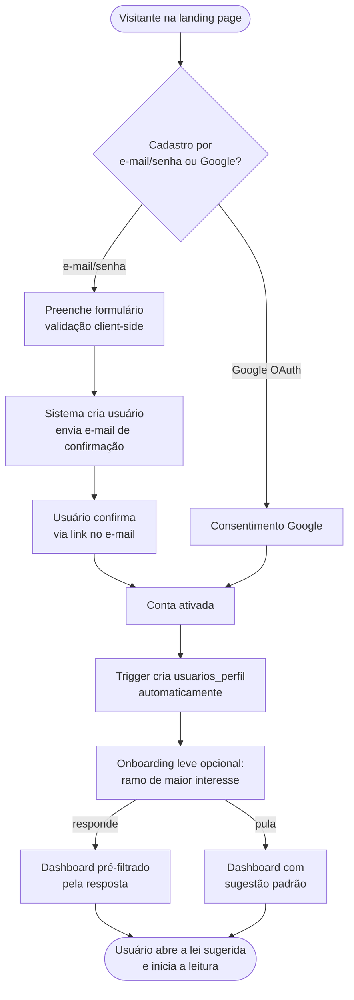
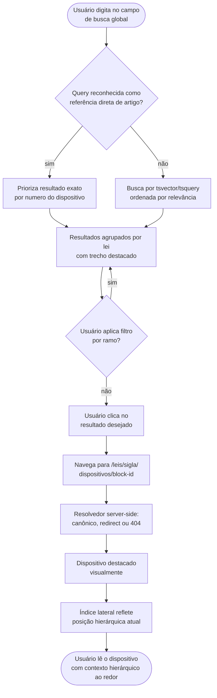
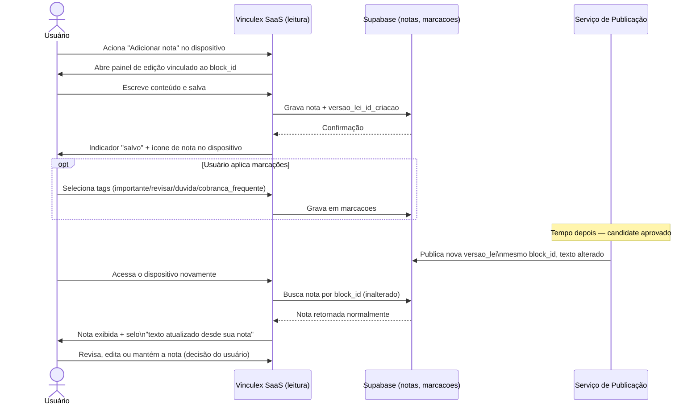
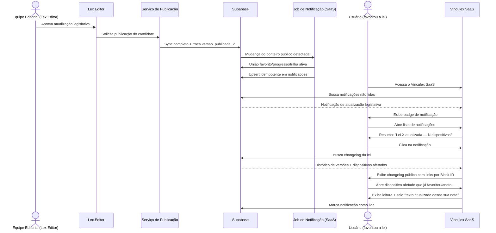
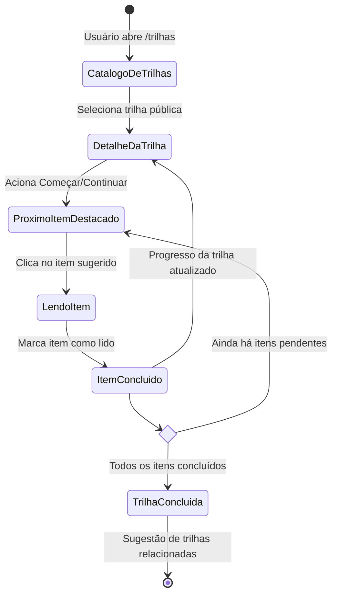
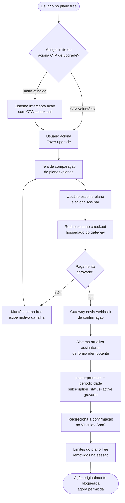
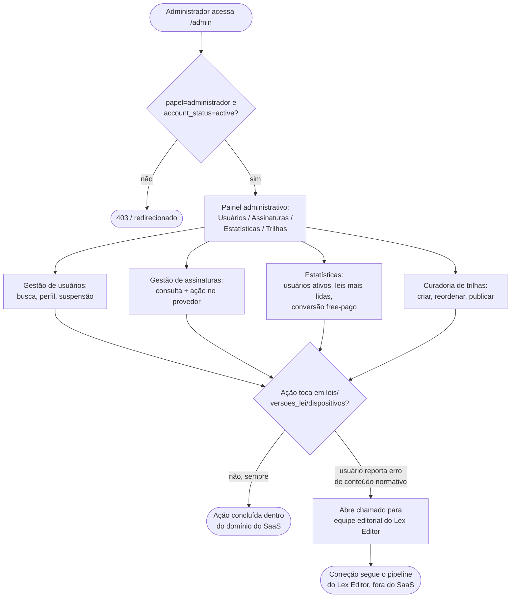

# Fluxos de Usuário — Vinculex SaaS

> Referências: `../architecture/SYSTEM_ARCHITECTURE.md`, `../architecture/DATA_MODEL.md`, `../architecture/UPDATE_PIPELINE.md`, `../architecture/ADR-005-status-fields.md`, `../architecture/ADR-007-fronteira-segura-publicacao.md`, `../architecture/ADR-008-monetizacao-e-gateway.md`, `./ROADMAP.md`.
> Este documento descreve os fluxos operacionais do Vinculex SaaS sob a ótica de duas personas: o **usuário final** (concurseiro CFO/PMMG, estudante de Direito, advogado, servidor público — consumidor do conteúdo já publicado) e o **administrador do Vinculex SaaS** (gestão de usuários e assinaturas, persona distinta do Editor Jurídico e do Administrador Técnico do Lex Editor, sem qualquer acesso a edição de conteúdo normativo). Cada fluxo traz passo a passo numerado (ação do usuário / resposta do sistema) e um diagrama Mermaid correspondente.

## Sumário

1. [Cadastro e primeiro acesso](#1-cadastro-e-primeiro-acesso) — Usuário final
2. [Buscar e ler um artigo específico](#2-buscar-e-ler-um-artigo-específico) — Usuário final
3. [Favoritar um dispositivo e organizá-lo em uma coleção](#3-favoritar-um-dispositivo-e-organizá-lo-em-uma-coleção) — Usuário final
4. [Criar uma nota vinculada a um Block ID](#4-criar-uma-nota-vinculada-a-um-block-id) — Usuário final
5. [Receber e revisar uma atualização legislativa de uma lei acompanhada](#5-receber-e-revisar-uma-atualização-legislativa-de-uma-lei-acompanhada) — Usuário final
6. [Seguir uma trilha de estudo pública](#6-seguir-uma-trilha-de-estudo-pública) — Usuário final
7. [Upgrade de plano gratuito para pago](#7-upgrade-de-plano-gratuito-para-pago) — Usuário final
8. [Fluxo administrativo — gerenciar usuários e visualizar estatísticas](#8-fluxo-administrativo--gerenciar-usuários-e-visualizar-estatísticas) — Administrador do Vinculex SaaS

---

## 1. Cadastro e primeiro acesso

**Persona:** Usuário final (concurseiro, estudante, profissional).
**Pré-condição:** Visitante não autenticado na landing page do Vinculex.
**Pós-condição de sucesso:** Conta criada, sessão ativa, usuário chega à primeira tela útil do produto com um mínimo de contexto sobre onde começar.

### Passo a passo

1. O visitante acessa a landing page e aciona "Criar conta" (ou "Entrar com Google").
2. **Caminho e-mail/senha:** o visitante preenche e-mail, senha e confirmação de senha; validação client-side (Zod) confere força mínima de senha e formato de e-mail antes do envio.
   **Caminho OAuth Google:** o visitante é redirecionado ao consentimento do Google e retorna autenticado sem etapa de senha.
3. No caminho e-mail/senha, o sistema cria o usuário no Supabase Auth e envia e-mail de confirmação (double opt-in); o visitante é informado na tela para verificar a caixa de entrada antes de ter acesso completo.
4. O visitante clica no link de confirmação recebido por e-mail; o sistema valida o token, ativa a conta e redireciona para login (ou já efetua login automático, dependendo da configuração do fluxo Supabase).
5. Com a sessão criada (por qualquer um dos dois caminhos), o trigger de banco popula `usuarios_perfil` automaticamente a partir de `auth.users` — o usuário nunca fica em um estado "autenticado sem perfil".
6. O sistema apresenta um onboarding leve, opcional e rápido (1–2 telas, dispensável a qualquer momento): pergunta o ramo de maior interesse imediato (ex.: "Estou estudando para CFO/PMMG" pré-selecionando Direito Penal, Processual Penal, Constitucional, ECA, CTB) para pré-filtrar o catálogo na primeira visita — sem bloquear o acesso caso o usuário prefira pular.
7. O sistema redireciona o usuário ao `/dashboard`, que nesta primeira visita exibe estado vazio orientado a ação: destaque para o catálogo (`/biblioteca`), sugestão da lei mais relevante conforme resposta do onboarding (ou lei mais popular entre concurseiros, na ausência de resposta), e nenhum dado de progresso/favoritos ainda (primeira sessão).
8. O usuário aciona a lei sugerida e é levado à página de leitura correspondente, iniciando o uso real do produto.

### Diagrama



---

## 2. Buscar e ler um artigo específico

**Persona:** Usuário final.
**Pré-condição:** Usuário autenticado, com pelo menos uma lei publicada disponível no catálogo.
**Pós-condição de sucesso:** Usuário está lendo o dispositivo exato buscado, com contexto hierárquico ao redor visível.

### Passo a passo

1. O usuário aciona o campo de busca global no header (disponível em qualquer tela autenticada) e digita um termo — pode ser um termo jurídico livre (ex.: "excludente de ilicitude") ou uma referência direta de artigo (ex.: "art. 121 CP").
2. O sistema aplica debounce e, para queries reconhecidas como referência direta de artigo, prioriza o resultado exato daquele dispositivo; para termos livres, consulta o índice `tsvector` e ordena por relevância (`ts_rank`).
3. O sistema exibe resultados agrupados por lei, com trecho de texto destacado (highlight) em torno do termo encontrado.
4. Opcionalmente, o usuário aplica um filtro adicional por ramo do direito para reduzir o escopo, caso o termo seja ambíguo entre leis.
5. O usuário clica no resultado e navega para
   `/leis/[sigla]/dispositivos/[blockId]`.
6. O resolvedor server-side retorna o dispositivo público. Se o ID for alias,
   responde com redirect permanente para o Block ID canônico; então a página
   rola e destaca o dispositivo.
7. O usuário observa o índice/sumário lateral colapsável, que já reflete a posição atual na hierarquia (livro/título/capítulo/seção em que o artigo está inserido), permitindo navegar para dispositivos vizinhos (artigo anterior/seguinte, ou subir um nível na hierarquia) sem precisar buscar novamente.
8. Se o dispositivo tiver `device_status` diferente de `active` (ex.: revogado), o usuário vê a sinalização visual e o texto explicativo (`nota_status`) diretamente no contexto de leitura, sem precisar sair da página para descobrir isso.

### Diagrama



---

## 3. Favoritar um dispositivo e organizá-lo em uma coleção

**Persona:** Usuário final.
**Pré-condição:** Usuário autenticado, lendo um dispositivo específico (chegou via navegação direta, busca ou link).
**Pós-condição de sucesso:** Dispositivo favoritado e associado a uma coleção (nova ou existente), visível em `/favoritos` e em `/colecoes/[id]`.

### Passo a passo

1. Na página de leitura, o usuário aciona o ícone de favoritar (estrela/marcador) junto ao dispositivo desejado.
2. O sistema aplica a mutação de forma otimista: o ícone muda de estado imediatamente (favoritado), antes mesmo da confirmação do servidor, com rollback silencioso caso a escrita em `favoritos` falhe (ex.: perda de conectividade).
3. A função grava `block_id`, `lei_id` e `versao_lei_id_criacao` derivada do
   ponteiro público; nunca aceita `user_id` ou versão informados pelo cliente.
4. Um pequeno menu contextual aparece após favoritar, oferecendo a ação "Adicionar a uma coleção" — o usuário pode ignorá-la (o favorito já existe de forma avulsa) ou prosseguir.
5. Ao escolher "Adicionar a uma coleção", o sistema exibe as coleções existentes do usuário (se houver) e a opção "Criar nova coleção".
6. **Caminho coleção existente:** o usuário seleciona uma ou mais coleções já criadas; o sistema grava a associação em `colecao_itens`.
   **Caminho nova coleção:** o usuário informa nome (obrigatório) e descrição (opcional); o sistema cria o registro em `colecoes` e associa o item recém-favoritado a ela em seguida.
7. O sistema confirma a associação com feedback visual breve (toast) e fecha o menu contextual.
8. O usuário pode a qualquer momento acessar `/favoritos` (lista plana de todos os favoritos, agrupados por lei) ou `/colecoes/[id]` (itens daquela coleção específica) para revisar, remover o favorito ou reorganizar a associação a coleções.

### Diagrama

```mermaid
flowchart TD
    A([Usuário lendo um dispositivo]) --> B[Aciona ícone de favoritar]
    B --> C[Mutação otimista:\nícone muda de estado]
    C --> D[Grava em favoritos\npor block_id + lei_id]
    D --> E{Falha de rede?}
    E -- sim --> E1[Rollback do ícone\ne aviso de erro] --> A
    E -- não --> F[Menu contextual:\nAdicionar a coleção?]
    F -- ignora --> G([Favorito avulso\nvisível em /favoritos])
    F -- adicionar --> H{Coleção existente\nou nova?}
    H -- existente --> I[Seleciona coleção(ões)\ne grava em colecao_itens]
    H -- nova --> J[Informa nome/descrição\ncria colecoes + colecao_itens]
    I --> K[Confirmação visual]
    J --> K
    K --> L([Item visível em /favoritos\ne em /colecoes/[id]])
```

---

## 4. Criar uma nota vinculada a um Block ID

**Persona:** Usuário final.
**Pré-condição:** Usuário autenticado, lendo um dispositivo específico.
**Pós-condição de sucesso:** Nota criada e vinculada ao `block_id` do dispositivo; a nota permanece corretamente vinculada e visível mesmo depois que o texto do dispositivo é alterado por uma atualização legislativa futura.

### Passo a passo

1. Na página de leitura, o usuário aciona o ícone de "Adicionar nota" no dispositivo desejado.
2. O sistema abre um painel lateral (ou modal) com um campo de texto (suporte a Markdown básico), vazio se não houver nota prévia para aquele `block_id`, ou preenchido com o conteúdo existente caso já exista uma nota.
3. O usuário escreve o conteúdo e aciona “Salvar” ou `Ctrl/Cmd+Enter`. O MVP
   não usa autosave; fechar o painel com alterações pendentes exige confirmação
   para descartar, evitando perda silenciosa e estados ambíguos de sincronização.
4. O sistema grava a nota com `block_id`, `lei_id` e
   `versao_lei_id_criacao` igual ao ponteiro público que forneceu o texto
   visível, e exibe o indicador “salvo”.
5. O sistema passa a exibir um ícone indicador no dispositivo (na leitura e no índice lateral) sinalizando que há uma nota associada, sem expor o conteúdo até o usuário abrir o painel novamente.
6. O usuário pode aplicar, no mesmo fluxo, uma ou mais marcações rápidas (`importante`, `revisar`, `duvida`, `cobranca_frequente`) ao mesmo dispositivo, gravadas em `marcacoes` de forma independente da nota (uma nota não exige marcação, e vice-versa).
7. **Tempo depois — uma atualização aprovada é concluída pelo Serviço de
   Publicação**, gerando nova `versoes_lei`; o dispositivo alterado mantém o
   mesmo `block_id`.
8. Na próxima vez que o usuário acessa esse dispositivo (via leitura direta, busca ou a partir de `/notas`), o sistema resolve a nota pelo `block_id` — que não mudou — e a exibe normalmente, vinculada ao dispositivo mesmo com o novo texto.
9. O sistema compara o texto do Block ID em `versao_lei_id_criacao` com o
   snapshot público atual. Só sinaliza “texto atualizado desde sua nota”
   quando os textos diferem, sem desvincular ou apagar a nota.
10. O usuário pode editar a nota para refletir a nova redação, mantê-la como está (relevante como registro histórico de estudo), ou removê-la — a decisão é sempre do usuário, nunca automática.

### Diagrama



---

## 5. Receber e revisar uma atualização legislativa de uma lei acompanhada

**Persona:** Usuário final.
**Pré-condição:** Usuário elegível à notificação personalizada acompanha a
lei por favorito, progresso ou trilha ativa; a equipe editorial aprova e o
Serviço de Publicação conclui uma nova versão.
**Pós-condição de sucesso:** Usuário é notificado, revisa o que mudou e entende o impacto sobre dispositivos que já favoritou ou anotou.

### Passo a passo

1. **(Fora do SaaS)** O Lex Editor envia o candidate aprovado; o Serviço de
   Publicação promove o SHA, sincroniza e troca
   `leis.versao_publicada_id`.
2. Uma função privada reage após a troca e calcula a união dos usuários com
   favorito da lei, progresso registrado ou trilha ativa que a contém,
   filtrando conta ativa e entitlement Premium vigente.
3. Insere uma única `notificacoes` por
   `(user_id, versao_lei_id, tipo_notificacao)`, mesmo se houver vários
   critérios de acompanhamento.
4. Na próxima visita do usuário ao produto, o sistema exibe um indicador de notificação não lida (badge no header ou no dashboard).
5. O usuário abre a lista de notificações e vê a entrada referente à atualização, com o nome da lei e um resumo curto (ex.: "Código Penal foi atualizado — 3 dispositivos alterados").
6. O usuário clica na notificação e é levado a `/leis/[sigla]/changelog`, que lista o histórico de versões publicadas daquela lei, com a nova versão em destaque.
7. O sistema usa `api.changelog_publico`: mostra `changelog` e gera os links
   a partir das listas de Block IDs em `mudancas`.
8. O usuário clica em um dispositivo afetado que também havia favoritado ou anotado anteriormente; o sistema o leva à leitura desse dispositivo, já exibindo o selo "texto atualizado desde sua nota/favorito" quando aplicável (reforçando a continuidade descrita no fluxo 4).
9. O sistema marca a notificação como lida quando o usuário abre seu destino.
   Apenas expandir a central de notificações não altera `lida_em`; a lista
   também oferece “marcar todas como lidas”.

### Diagrama



---

## 6. Seguir uma trilha de estudo pública

**Persona:** Usuário final.
**Pré-condição:** Usuário com feature de progresso em trilhas habilitada;
existem trilhas públicas curadas pela equipe do Vinculex SaaS.
**Pós-condição de sucesso:** Usuário está seguindo uma trilha, com progresso item a item sendo acompanhado corretamente.

### Passo a passo

1. O usuário acessa `/trilhas` a partir da navegação principal (ou de uma sugestão no dashboard).
2. O sistema lista trilhas públicas com título, descrição, `foco_concurso` e
   quantidade de itens.
3. O usuário filtra por foco de concurso e seleciona uma trilha.
4. O sistema abre `/trilhas/[id]`, exibindo a lista ordenada de itens da trilha (leis inteiras ou dispositivos específicos), com o progresso do usuário já sobreposto a cada item — reaproveitando `progresso_leitura` quando o item corresponde a um dispositivo/lei já lido anteriormente pelo usuário, mesmo fora do contexto da trilha.
5. O usuário aciona “Começar”; o sistema ativa a linha em
   `trilhas_usuario`, desativa a trilha anterior e destaca o próximo item.
6. O usuário clica no item sugerido e é levado à página de leitura correspondente (lei ou dispositivo específico).
7. Ao marcar um artigo como lido, o sistema registra `eventos_leitura`; o
   progresso da trilha é derivado desses eventos. Um item de lei inteira fica
   concluído quando o progresso daquela lei chega a 100%.
8. O sistema avança automaticamente a indicação de "próximo item sugerido" para o item seguinte da sequência da trilha.
9. Ao atingir 100%, o sistema confirma a conclusão e pode sugerir trilhas com
   o mesmo `foco_concurso`.

### Diagrama



---

## 7. Upgrade de plano gratuito para pago

**Persona:** Usuário final (no plano gratuito).
**Pré-condição:** Usuário autenticado no plano `free`, atinge um limite do plano ou aciona um CTA de upgrade voluntariamente.
**Pós-condição de sucesso:** Assinatura paga ativa, refletida em `assinaturas`, com os limites do plano gratuito removidos imediatamente.

### Passo a passo

1. O usuário tenta criar o 21º favorito, a 6ª nota ou usar uma funcionalidade
   Premium (coleções, marcações, exportação, trilha privada, progresso completo
   ou notificação personalizada), ou aciona voluntariamente um CTA de upgrade.
2. O sistema intercepta a ação via hook de verificação de plano e, em vez de erro genérico, exibe um CTA contextual explicando o limite atingido e o benefício de fazer upgrade.
3. O usuário aciona "Fazer upgrade" e é levado à tela de comparação de planos (`/planos`), com os benefícios do plano pago listados de forma concreta (limites removidos, features exclusivas).
4. O usuário escolhe Premium e a periodicidade mensal ou anual, então aciona
   “Assinar”.
5. O backend cria um Checkout hospedado do Asaas para Premium mensal
   (R$ 19,90) ou anual (R$ 199,00), e o navegador é redirecionado para a URL
   retornada; API key e identificadores de autoridade não chegam ao cliente.
6. O usuário paga por cartão — com renovação automática — ou Pix, que exige
   pagamento ativo a cada ciclo.
7. O Asaas envia o evento. O endpoint autentica `asaas-access-token`, reserva
   `(provedor, evento_id)` e responde rapidamente; um worker consulta o
   recurso na API do Asaas antes de aplicar o estado.
8. Após confirmação reconciliada, o sistema atualiza (ou cria)
   `assinaturas` com `plano = 'premium'`, `periodicidade = 'mensal'` ou
   `'anual'`, `subscription_status = 'active'`, identificadores externos e
   período vigente. O redirect do navegador, sozinho, nunca ativa Premium.
9. O sistema redireciona o usuário de volta ao Vinculex SaaS (página de confirmação pós-checkout), exibindo a assinatura ativa e removendo imediatamente os limites do plano gratuito na sessão corrente.
10. A ação originalmente bloqueada no passo 1 (se aplicável) passa a ser permitida sem necessidade de o usuário repetir o fluxo de onboarding ou login.
11. Em caso de falha, expiração do Pix ou cancelamento no checkout, o sistema
    mantém o usuário no plano gratuito, exibe mensagem segura e oferece nova
    tentativa sem perda de contexto. Evento duplicado ou fora de ordem não
    reaplica efeitos.

### Diagrama



---

## 8. Fluxo administrativo — gerenciar usuários e visualizar estatísticas

**Persona:** Administrador do Vinculex SaaS (papel de gestão de produto/operação — distinto do Editor Jurídico e do Administrador Técnico do Lex Editor, sem qualquer acesso a edição de conteúdo normativo).
**Pré-condição:** Administrador autenticado com `papel = 'administrador'` e
`account_status = 'active'`.
**Pós-condição de sucesso:** Administrador consultou/agiu sobre usuários e assinaturas, e visualizou estatísticas consolidadas de uso — sem ter tocado em `leis`, `versoes_lei` ou `dispositivos` em nenhum momento.

### Passo a passo

1. O administrador acessa `/admin`; o servidor verifica sessão, `papel` e
   `account_status`. Falha em qualquer condição retorna 403 sem renderizar
   dados administrativos.
2. O sistema exibe o painel administrativo com navegação para quatro áreas:
   Usuários, Assinaturas, Estatísticas e Trilhas.
3. **Gestão de usuários:** o administrador busca um usuário por e-mail ou nome, visualiza o perfil (`usuarios_perfil`), histórico de assinatura resumido e, se necessário, aciona a ação de suspensão de conta (ex.: violação de termos de uso), registrando o motivo.
4. **Gestão de assinaturas:** o administrador consulta estado e histórico
   vindo do gateway e pode solicitar cancelamento/reembolso ao provedor. Não
   edita `subscription_status`; a mudança ocorre somente após webhook
   verificado e idempotente.
5. **Estatísticas:** o administrador acessa métricas agregadas de usuários
   ativos, leis mais lidas e conversão. Consultas de busca não são armazenadas
   como texto no schema transacional; qualquer telemetria futura exige
   contrato de privacidade, minimização e retenção próprio.
6. **Curadoria de trilhas:** em `/admin/trilhas`, o administrador cria,
   reordena e publica trilhas. Um usuário com `papel = 'curador'` pode acessar
   somente essa área, nunca Usuários, Assinaturas ou Estatísticas.
7. Conteúdo normativo aparece apenas por projeções públicas/agregadas. O
   endpoint administrativo privado não concede acesso às tabelas editoriais.
8. Caso o administrador precise de uma correção de conteúdo normativo (ex.: um usuário reportou um erro de texto em um dispositivo), o fluxo correto é abrir um chamado/ticket para a equipe editorial do Lex Editor — o painel administrativo do SaaS não oferece nenhum atalho técnico para contornar essa separação de responsabilidades.

### Diagrama


